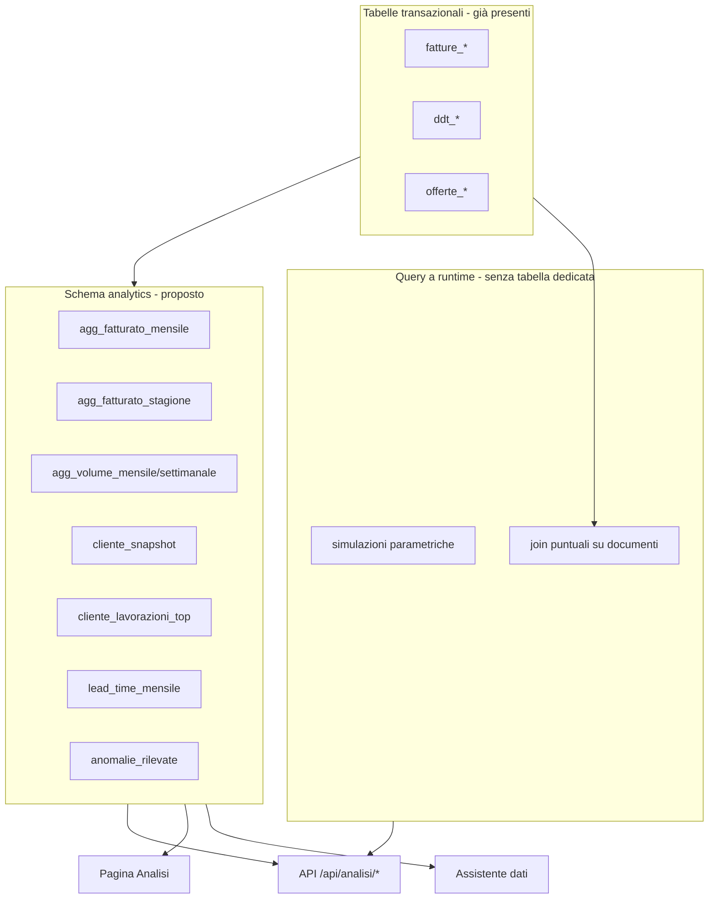

# Analisi: domande `domande2.txt` e layer analytics pre-calcolato

Documento di proposta (nessuna modifica al codice). Obiettivo: definire come rispondere in modo scalabile alle 32 domande del secondo set, con particolare attenzione al **fatturato mensile per cliente** calcolato dallo script di sync e a una **pagina dedicata** per metriche derivate.

---

## 1. Sintesi esecutiva

Le domande in `domande2.txt` non sono più ricerche documentali puntuali (come in `domande-risposte.txt`), ma **analisi gestionali**: ranking, confronti temporali, segnali di erosione, lead time, auditing incrociato, score compositi e simulazioni.

Oggi il sistema risponde bene a elenchi e dettagli (bolle, fatture, ordini, discrepanze per singolo cliente), ma **non ha un layer di aggregazione**. Il prompt LLM ammette esplicitamente che per il totale fatturato non esiste una vista aggregata e suggerisce `esegui_somma` sui risultati filtrati — approccio accettabile per una domanda isolata, insufficiente per 32 pattern analitici ripetuti e per un assistente che deve combinare più indicatori.

**Proposta centrale:** introdurre uno **schema analytics** (tabelle mart o materialized views) popolato **a fine sync** da `oracle-sync.py`, separato dalle tabelle transazionali già sincronizzate. Il fatturato mensile per cliente è il primo mattoncino, ma da solo copre solo ~8–10 delle 32 domande; serve un piccolo **ecosistema di tabelle pre-calcolate** a grana fissa.

**Pagina UI:** una nuova area **«Analisi»** (meglio di una pagina solo «Fatturati») che espone cruscotto, classifiche e alert, con API dedicate consumabili anche dall’assistente LLM.

---

## 2. Stato attuale e gap

### 2.1 Cosa c’è già

| Asset | Uso attuale |
|-------|-------------|
| `fatture_testate` / `fatture_righe` | Fatturato a livello disposizione e riga |
| `ddt_testate` / `ddt_righe` | Consegne, collegamenti a disposizione e cartellino |
| `offerte_testate` / `offerte_righe` | Cartellini derivati dalle righe DDT (`D03_DDT_RIGHE_002W`) |
| `discrepanze` | Confronto ordine/bolla/fattura per cliente (domande 21, parzialmente 19–20) |
| Sync ibrido full/incremental | Popolamento cache TimescaleDB da ORDS |

### 2.2 Gap rilevanti per `domande2.txt`

| Gap | Domande impattate |
|-----|-------------------|
| Nessuna aggregazione temporale | 1, 2, 3, 7, 8, 15, 16, 26, 27, 30 |
| Nessuna «foto cliente» (ultimo ordine, frequenza, primo ordine) | 4, 5, 6, 8, 31 |
| Campi `cd_lavorazione` / `ds_lavorazione` non sincronizzati in locale | 9, 17, 24, 25 |
| Nessuna data incasso / giorni pagamento (`stato_pagamento` rimosso da schema) | 10, 28, 29 |
| Lead time bolla entrata → DDT uscita non materializzato (`ew1_data_bolla_cli` esiste su Oracle, parzialmente usato in sync offerte) | 11, 12, 13, 28 |
| Nessun flag ordini aperti / chiusi persistito | 14, 23 |
| Margine reale assente (solo proxy da prezzo) | 24, 25, 29 |
| Assistente senza `area` analitica dedicata | tutte |

### 2.3 Nota su `data_fattura`

Lo sync attuale popola `fatture_testate.data_fattura` in parte da `data_bolla_iso` / `d02_dt_bolla` (data bolla), non sempre da `dt_fattura_iso`. Per analisi di fatturato **civilistico/gestionale** conviene allineare la definizione (bolla vs fattura) e documentarla; le aggregazioni mensili devono usare **una sola regola coerente**, idealmente `dt_fattura_iso` quando disponibile.

### 2.4 Prerequisiti transazionali (prima dell’analytics)

Questi punti — presenti in `gemini-analyses.md` e nel codice esistente — vanno trattati come **bloccanti** per aggregazioni stagionali e per lavorazione. L’analytics non deve compensare dati transazionali incompleti.

**Stagioni senza endpoint Oracle dedicato**

`Z11_STAGIONI` non è esposto (404). I codici stagione vanno estratti da `F07_003W` (`ew2_cd_stagione`) come già fa lo sync. Per UI e LLM, usare `backend/stagioni_aliases.py` per mappare codici legacy Oracle (es. `PE 26`, `AI 26`) in forme coerenti (es. `PE2026`, `AI25-26`).

**Backfill stagione su bolle e offerte**

`D03_DDT_RIGHE_002W` non espone sempre il codice stagione sulle righe. Senza propagazione, filtri e aggregati per stagione su bolle/offerte restano incompleti. Lo sync ha già `_backfill_stagione_codes()` (catena **fatture → bolle → offerte** tramite collegamenti locali). Questo step deve completarsi **prima** di `rebuild_analytics()`, non essere un optional.

**Colonne lavorazione su `fatture_righe`**

Per domande 9, 17, 24, 25 Oracle espone `cd_lavorazione` / `ds_lavorazione` su `F07_003W`, ma `create-tables.sql` non li include ancora:

```sql
ALTER TABLE fatture_righe ADD COLUMN cd_lavorazione VARCHAR(50);
ALTER TABLE fatture_righe ADD COLUMN ds_lavorazione VARCHAR(255);
```

Allineare `oracle-sync.py` a popolarli **prima** di calcolare `cliente_lavorazioni_top`.

---

## 3. Tassonomia delle 32 domande

Le domande si raggruppano in **5 famiglie di query** con grana e frequenza di aggiornamento diverse.



### 3.1 Mappa domanda → strategia

| # | Domanda (sintesi) | Strategia consigliata | Tabella / fonte |
|---|-------------------|----------------------|-----------------|
| 1 | Top 10 clienti per fatturato 12 mesi + % | Pre-calcolato + query leggera | `agg_fatturato_mensile` |
| 2 | Quota top 5 vs 2 anni fa | Confronto su stessa tabella, due finestre | `agg_fatturato_mensile` |
| 3 | Calo semestre su semestre | Rollup semestrale da mensile | `agg_fatturato_mensile` |
| 4 | Dormienti >90 gg, attivi prima | Snapshot cliente | `cliente_snapshot` |
| 5 | Allungamento intervallo tra ordini | Snapshot + storico eventi opzionale | `cliente_snapshot`, eventuale `cliente_eventi_ordine` |
| 6 | Valore medio ordine e conteggio anno | Aggregazione su offerte | `cliente_snapshot` o query su `offerte_testate` |
| 7 | Fatturato per stagione vs stagione precedente | Grana stagione | `agg_fatturato_stagione` |
| 8 | Clienti nuovi 12 mesi + fatturato | `first_order_date` + somma 12m | `cliente_snapshot` + `agg_fatturato_mensile` |
| 9 | Lavorazioni/capi più frequenti per cliente | Top-N per cliente | `cliente_lavorazioni_top` (richiede sync campi lavorazione) |
| 10 | Giorni medi fattura–incasso | **Bloccato** finché non c’è data incasso | Nuovo campo/endpoint Oracle |
| 11 | Lead time entrata → uscita per cliente | Media su documenti | `lead_time_documento` o snapshot |
| 12 | Trend lead time 24 mesi | Serie mensile | `lead_time_mensile` |
| 13 | Ordini con attraversamento più lungo | Query su tabella documento + indice | `lead_time_documento` |
| 14 | Ordini aperti e giorni | Anti-join offerte vs DDT (fase 1); tabella dedicata opzionale | Query runtime su `offerte_testate` + `ddt_righe` |
| 15 | Picchi volume per mese | Serie mensile aziendale | `agg_volume_mensile` |
| 16 | Volume settimanale vs anno precedente | Serie settimanale | `agg_volume_settimanale` |
| 17 | Lavorazioni per tempo/volume | Top lavorazioni globali | `lavorazioni_riepilogo` |
| 18 | Rifacimenti / ritardi anomali | Euristica su ritardi | `anomalie_rilevate` (fase 2) |
| 19 | DDT senza fattura >60 gg | Join runtime o snapshot | `anomalie_rilevate` |
| 20 | Valore consegne non fatturate per cliente | Somma DDT non collegati | `agg_consegne_non_fatturate` o runtime |
| 21 | Discrepanze quantità | **Già coperto** | `discrepanze` |
| 22 | Fatture senza DDT/ordine | Anti-join | Runtime su tabelle esistenti |
| 23 | Ordini chiusi senza DDT | Anti-join | Runtime + flag chiusura |
| 24 | Prezzo medio lavorazione sotto media | Confronto prezzi | `cliente_lavorazioni_top` + media globale |
| 25 | Variazioni prezzo nel tempo | Serie prezzo per SKU/lavorazione | `prezzo_storico_mensile` (fase 2) |
| 26 | Fatturato totale mese per mese 24m | Totale aziendale | `agg_fatturato_mensile` con riga `CLIENTE_TOTALE` o vista |
| 27 | Stagione vs stagione (€, ordini, volume) | Dashboard stagionale | `agg_fatturato_stagione` + `agg_volume_*` |
| 28 | Clienti «ideali» (€ alto, pagamento, lead time) | Score composito | `cliente_score` |
| 29 | Grandi ma «faticosi» | Score composito inverso | `cliente_score` |
| 30 | Stress test −20% top 3 | **Runtime** su mensile | API parametrica, no tabella |
| 31 | Clienti mono-stagione | Pattern stagioni per cliente | `cliente_stagioni_attive` |
| 32 | Top 3 anomalie/opportunità trimestre | Regole + LLM | `anomalie_rilevate` + sintesi |

**Copertura stimata**

- Solo `agg_fatturato_mensile`: ~9 domande (1, 2, 3, 8 parziale, 26, 27 parziale, 30).
- Con pacchetto analytics completo (sez. 4): ~24–26 domande.
- Con dati Oracle aggiuntivi (incasso, margini): fino a ~30.
- Domanda 32 resta intrinsecamente ibrida (regole + LLM).

---

## 4. Proposta schema analytics

Consiglio uno **schema dedicato** `analytics` (o prefisso `agg_` sulle tabelle) per separare chiaramente dati sincronizzati da ERP e dati derivati.

### 4.1 `agg_fatturato_mensile` (priorità 1 — la tua idea)

Grana: **un cliente per mese civile**.

```sql
CREATE TABLE analytics.agg_fatturato_mensile (
    codice_cliente   VARCHAR(50) NOT NULL REFERENCES clienti(codice),
    anno_mese        DATE NOT NULL,  -- sempre il 1° del mese (es. 2026-03-01)
    importo_fatturato NUMERIC(14, 2) NOT NULL DEFAULT 0,
    num_disposizioni  INTEGER NOT NULL DEFAULT 0,
    capi_fatturati    NUMERIC(12, 0) NOT NULL DEFAULT 0,
    kg_fatturati      NUMERIC(12, 3) NOT NULL DEFAULT 0,
    computed_at       TIMESTAMPTZ NOT NULL DEFAULT NOW(),
    PRIMARY KEY (codice_cliente, anno_mese)
);

CREATE INDEX idx_agg_fatt_mese ON analytics.agg_fatturato_mensile (anno_mese);
CREATE INDEX idx_agg_fatt_cliente ON analytics.agg_fatturato_mensile (codice_cliente);
```

**Nota sul design della chiave temporale:** un’alternativa valida (usata in `gemini-analyses.md`) è `(anno INTEGER, mese INTEGER)` invece di `anno_mese DATE`. Entrambe scalano bene; `anno_mese` si integra meglio con `date_trunc` e intervalli PostgreSQL. Scegliere una convenzione e usarla in tutte le tabelle analytics.

**Calcolo nel sync (pseudo-flusso):**

```sql
INSERT INTO analytics.agg_fatturato_mensile (codice_cliente, anno_mese, importo_fatturato, num_disposizioni, capi_fatturati, kg_fatturati)
SELECT
    f.codice_cliente,
    date_trunc('month', f.data_fattura)::date AS anno_mese,
    SUM(f.importo_totale),
    COUNT(DISTINCT f.numero_disposizione),
    COALESCE(SUM(r.capi_fatturati), 0),
    COALESCE(SUM(r.kg_fatturati), 0)
FROM fatture_testate f
LEFT JOIN fatture_righe r USING (codice_cliente, numero_disposizione)
WHERE f.data_fattura >= :rebuild_from   -- es. ultimi 36 mesi o mesi toccati dal sync
GROUP BY 1, 2
ON CONFLICT (codice_cliente, anno_mese) DO UPDATE SET
    importo_fatturato = EXCLUDED.importo_fatturato,
    num_disposizioni  = EXCLUDED.num_disposizioni,
    capi_fatturati    = EXCLUDED.capi_fatturati,
    kg_fatturati      = EXCLUDED.kg_fatturati,
    computed_at       = NOW();
```

**Totale aziendale (domanda 26):** opzione A — riga sintetica `codice_cliente = '__TOTALE__'`; opzione B — materialized view `SELECT anno_mese, SUM(...) FROM agg_fatturato_mensile GROUP BY 1`. Preferibile **opzione B** per non inquinare la FK verso `clienti`.

**Scalabilità:** con ~200–500 clienti e 36 mesi di storia si hanno ~18k righe — trascurabile. L’aggregazione costa O(righe fattura nel periodo di rebuild), eseguita **una volta a sync**, non a ogni domanda utente. Con incremental sync, ribuildare solo i mesi in cui sono cambiate disposizioni (tenere traccia in `analytics.sync_watermark`).

### 4.2 `agg_fatturato_stagione` (priorità 1 — tessile)

```sql
CREATE TABLE analytics.agg_fatturato_stagione (
    codice_cliente    VARCHAR(50) NOT NULL REFERENCES clienti(codice),
    codice_stagione   VARCHAR(50) NOT NULL REFERENCES stagioni(codice),
    importo_fatturato NUMERIC(14, 2) NOT NULL DEFAULT 0,
    num_disposizioni  INTEGER NOT NULL DEFAULT 0,
    computed_at       TIMESTAMPTZ NOT NULL DEFAULT NOW(),
    PRIMARY KEY (codice_cliente, codice_stagione)
);
```

Serve per domande **7, 27, 31**. La stagione è già su `fatture_testate.codice_stagione`.

### 4.3 `agg_volume_mensile` e `agg_volume_settimanale` (priorità 2)

Fonte: `ddt_righe` + `ddt_testate` (volume lavorato consegnato, proxy produzione).

- Mensile: domande **15, 27**
- Settimanale (ISO week): domanda **16**

Stessa logica di rebuild post-sync. Opzionale colonna `codice_cliente` NULL per totali aziendali.

### 4.4 `cliente_snapshot` (priorità 1 — erosione e profilo)

Tabella **una riga per cliente**, aggiornata a ogni sync analytics. Evita query costose su tutta la storia per le domande «chi è a rischio?».

```sql
CREATE TABLE analytics.cliente_snapshot (
    codice_cliente              VARCHAR(50) PRIMARY KEY REFERENCES clienti(codice),
    first_order_date            DATE,
    last_order_date             DATE,   -- da offerte_testate o ew1_data_bolla_cli
    days_since_last_order       INTEGER,
    orders_ytd                  INTEGER,
    avg_order_value_ytd         NUMERIC(14, 2),
    avg_days_between_orders_12m NUMERIC(8, 2),
    avg_days_between_orders_prev_12m NUMERIC(8, 2),  -- per domanda 5
    fatturato_rolling_12m       NUMERIC(14, 2),
    fatturato_prev_12m          NUMERIC(14, 2),
    fatturato_semestre_corrente NUMERIC(14, 2),
    fatturato_semestre_precedente NUMERIC(14, 2),    -- stesso semestre anno prima
    rank_fatturato_12m          INTEGER,
    pct_fatturato_12m           NUMERIC(6, 4),         -- quota sul totale
    is_dormant_90d              BOOLEAN,
    is_new_client_12m           BOOLEAN,
    stagioni_attive             VARCHAR(50)[],        -- per domanda 31
    computed_at                 TIMESTAMPTZ NOT NULL DEFAULT NOW()
);

CREATE INDEX idx_cliente_snapshot_rank ON analytics.cliente_snapshot (rank_fatturato_12m);
```

Alimentazione: join tra `agg_fatturato_mensile`, `offerte_testate`, e window functions SQL — tutto in un unico step `rebuild_cliente_snapshot()` nel sync.

Per le domande 1, 3–6, 8 il ranking e l’erosione possono essere letti **direttamente dallo snapshot** senza ricalcolare window functions a ogni richiesta API.

### 4.5 `cliente_lavorazioni_top` (priorità 2 — richiede estensione sync)

Per domande **9, 17, 24**. Oracle espone `cd_lavorazione` e `ds_lavorazione` su `F07_003W` (e potenzialmente sulle righe DDT).

```sql
CREATE TABLE analytics.cliente_lavorazioni_top (
    codice_cliente   VARCHAR(50) NOT NULL,
    cd_lavorazione   VARCHAR(50) NOT NULL,
    ds_lavorazione   VARCHAR(255),
    volume_capi      NUMERIC(12, 0),
    volume_kg        NUMERIC(12, 3),
    importo          NUMERIC(14, 2),
  rank_by_importo  INTEGER,
    PRIMARY KEY (codice_cliente, cd_lavorazione)
);
```

**Prerequisito:** aggiungere `cd_lavorazione` / `ds_lavorazione` a `fatture_righe` o `ddt_righe` nello sync transazionale, poi aggregare.

### 4.6 `lead_time_documento` e `lead_time_mensile` (priorità 2)

Per domande **11, 12, 13, 28**.

A livello documento (cartellino o coppia entrata/uscita):

```sql
CREATE TABLE analytics.lead_time_documento (
    numero_offerta     VARCHAR(100) PRIMARY KEY REFERENCES offerte_testate(numero_offerta) ON DELETE CASCADE,
    codice_cliente     VARCHAR(50) NOT NULL REFERENCES clienti(codice),
    data_bolla_entrata DATE NOT NULL,  -- ew1_data_bolla_cli
    data_ddt_uscita    DATE NOT NULL,  -- ddt_testate.data_bolla
    lead_time_giorni   INTEGER NOT NULL,
    codice_stagione    VARCHAR(50)
);

CREATE INDEX idx_lead_time_doc_cliente ON analytics.lead_time_documento (codice_cliente);
```

`data_bolla_entrata` ← `ew1_data_bolla_cli` (già letto in sync offerte); `data_ddt_uscita` ← `ddt_testate.data_bolla` collegata al cartellino.

`lead_time_mensile`: media/mediana per `date_trunc('month', data_ddt_uscita)` — domanda 12.

### 4.7 `anomalie_rilevate` (priorità 2–3)

Per domande **19, 20, 22, 23, 32** e alert in UI.

```sql
CREATE TABLE analytics.anomalie_rilevate (
    id              SERIAL PRIMARY KEY,
    tipo            VARCHAR(50) NOT NULL,  -- 'ddt_senza_fattura', 'fattura_senza_ddt', 'calo_fatturato', ...
    severita        SMALLINT NOT NULL,     -- 1-5
    codice_cliente  VARCHAR(50),
    riferimento     VARCHAR(100),          -- numero bolla, disposizione, ecc.
    descrizione     TEXT,
    valore_stimato  NUMERIC(14, 2),
    giorni_ritardo  INTEGER,               -- es. giorni DDT senza fattura (Q19)
    rilevata_il     DATE NOT NULL,
    trimestre       VARCHAR(7) NOT NULL,     -- es. '2026-Q2'
    computed_at     TIMESTAMPTZ NOT NULL DEFAULT NOW()
);

CREATE INDEX idx_anomalie_trimestre ON analytics.anomalie_rilevate (trimestre, severita DESC);
```

Popolamento rule-based a fine sync. La domanda 32 chiede all’assistente di **sintetizzare** le righe con `severita` più alta nel trimestre corrente.

**Regole euristiche suggerite** (da `gemini-analyses.md`, utili per Q18 e Q25 senza nuove tabelle):

| Tipo anomalia | Regola nel sync |
|---------------|-----------------|
| `ddt_non_fatturato_60g` | DDT in uscita senza `numero_disposizione` su righe e `data_bolla` > 60 giorni fa |
| `fattura_senza_ddt` | Disposizione in `fatture_testate` senza righe DDT collegate |
| `ordine_senza_ddt` | Cartellino in `offerte_testate` mai referenziato in `ddt_righe` |
| `lavorazione_ritardo_anomalo` (Q18) | Lead time del cartellino > 150% della media per la stessa `cd_lavorazione` |
| `prezzo_spostamento` (Q25) | Stesso articolo/lavorazione per cliente con deviazione prezzo > 10% rispetto alla media storica recente del cliente |

### 4.8 `cliente_score` (priorità 3)

Per domande **28, 29**. Score composito normalizzato 0–100:

| Componente | Fonte | Peso suggerito |
|------------|-------|----------------|
| Fatturato 12m | `cliente_snapshot` | 40% |
| Lead time | `lead_time_documento` | 25% |
| Giorni pagamento | incasso (quando disponibile) | 25% |
| Prezzo vs media | `cliente_lavorazioni_top` | 10% |

Senza incasso, ridistribuire il peso su fatturato e lead time e marcare il score come `partial = true` in API.

**Formula alternativa senza pagamenti** (fase 2, da affinare con dati reali):

$$\text{Score} = 0{,}5 \times \text{rank\_fatturato} + 0{,}3 \times \text{rank\_lead\_time\_inverso} + 0{,}2 \times \text{rank\_frequenza\_ordini}$$

**Clienti «faticosi» (Q29):** filtro su snapshot — fatturato sopra il 75° percentile aziendale **e** (lead time produzione o intervallo ordini sopra l’80° percentile, oppure prezzo medio lavorazione sotto la media globale quando disponibile).

### 4.9 Metadati sync

```sql
CREATE TABLE analytics.sync_meta (
    job_name        VARCHAR(50) PRIMARY KEY,
    last_success    TIMESTAMPTZ,
    last_error      TEXT,
    rows_affected   INTEGER,
    elapsed_seconds NUMERIC(8, 2)
);
```

Utile per mostrare in UI «Dati analitici aggiornati al …» e per rebuild incrementale.

---

## 5. Alternativa: solo materialized views?

| Approccio | Pro | Contro |
|-----------|-----|--------|
| **Tabelle mart + rebuild nel sync** | Incrementale, metadati, storico `computed_at`, facile da testare | Più DDL e codice Python |
| **MATERIALIZED VIEW** | Meno codice, sempre coerente con SQL | `REFRESH` full costoso; refresh concorrente PostgreSQL limitato; meno controllo incrementale |
| **Query diretta su transazionale** | Zero lavoro infra | Non scala con assistente LLM e storico; latenza imprevedibile |

**Raccomandazione:** tabelle mart aggiornate nello script di sync (dopo il commit delle tabelle transazionali). Per prototipo rapido si può iniziare con una sola MV `agg_fatturato_mensile`, ma conviene passare presto a tabella gestita per supportare rebuild parziale.

---

## 6. Integrazione nello script di sync

Estendere `oracle-sync.py` con una fase finale:

```
sync_clienti → sync_articoli → sync_fatture → sync_bolle → sync_offerte
    → rebuild_analytics()
```

`rebuild_analytics()`:

1. Determina l’intervallo da ricalcolare (full: ultimi 36 mesi; incremental: mesi toccati dalle fatture/DDT modificate nel run).
2. Upsert `agg_fatturato_mensile`, `agg_fatturato_stagione`, `agg_volume_*`.
3. `rebuild_cliente_snapshot()` (dipende da step 2).
4. `rebuild_lead_time_*` (se dati entrata disponibili).
5. `detect_anomalie()` → `anomalie_rilevate`.
6. `rebuild_cliente_score()` (opzionale).
7. Aggiorna `analytics.sync_meta`.

**Lock:** riusare il lock già previsto per il sync (un solo processo). Il rebuild analytics deve essere **transazionale** (BEGIN … COMMIT) per evitare letture inconsistenti dall’API mentre Bottle serve `/api/analisi/*`.

**Gestione errori:** in caso di fallimento, registrare `last_error` in `sync_meta` senza lasciare tabelle analytics a metà (rollback della transazione analytics). Il sync transazionale può comunque essere andato a buon fine.

**CLI:** `python oracle-sync.py --targets fatture,bolle --rebuild-analytics` oppure analytics sempre on per default.

---

## 7. API e assistente LLM

### 7.1 Nuovi endpoint (esempi)

| Endpoint | Domande |
|----------|---------|
| `GET /api/analisi/fatturato/mensile?mesi=24&cliente=` | 1, 26 |
| `GET /api/analisi/clienti/ranking?periodo=12m&limit=10` | 1 |
| `GET /api/analisi/clienti/concentrazione?top_n=5&confronto_anni=2` | 2 |
| `GET /api/analisi/clienti/erosione` | 3, 5 |
| `GET /api/analisi/clienti/dormienti` | 4 |
| `GET /api/analisi/clienti/stagione?stagione=PE%2026` | 7, 27 |
| `GET /api/analisi/clienti/nuovi?mesi=12` | 8 |
| `GET /api/analisi/produzione/lead-time` | 11, 12, 13 |
| `GET /api/analisi/produzione/volume` | 15, 16 |
| `GET /api/analisi/controllo/non-fatturato` | 19, 20 |
| `GET /api/analisi/clienti/score?tipo=ideale` | 28, 29 |
| `POST /api/analisi/simulazioni/stress-clienti` body `{top_n:3, riduzione_pct:20}` | 30 |
| `GET /api/analisi/opportunita/trimestre` | 32 |

Ogni endpoint restituisce JSON tabellare pronto per UI e per il contesto LLM (evitare di far «inventare» SQL al modello).

### 7.2 Estensione prompt assistente

Aggiungere area `analisi` in `prompts.txt` con mapping:

- «concentrazione clienti», «top clienti», «chi sta calando» → endpoint ranking/erosione
- «andamento fatturato» → mensile
- «stress test» → simulazione
- «anomalie trimestre» → opportunita/trimestre

L’assistente imposta filtri e chiama API deterministiche invece di `esegui_somma` su elenchi documentali.

---

## 8. Proposta pagina UI: area «Analisi»

Una pagina solo «Fatturati» rischia di restare troppo stretta quando si aggiungono lead time, volume e score. Meglio un hub **Analisi / Cruscotto** con sotto-sezioni.

### 8.1 Navigazione

```
Bolle | Fatture | Ordini | Discrepanze | Analisi   ← nuova voce principale
```

### 8.2 Layout suggerito

**Tab 1 — Clienti & fatturato**

- KPI: fatturato 12m, Δ vs anno precedente, % top 5 (domande 1, 2, 26)
- Grafico a torta o barre per quota top 5 con confronto dinamico a 2 anni fa (domanda 2)
- Tabella ranking clienti con barra % sul totale
- Sezione «A rischio»: dormienti, calo semestrale, intervallo ordini in aumento (3, 4, 5)
- Confronto stagione corrente vs precedente per cliente selezionato (7)
- Clienti nuovi (8)

**Tab 2 — Produzione**

- Grafico lead time medio 24 mesi (12)
- Picchi mensili volume / confronto settimanale YoY (15, 16)
- Top lavorazioni (17) — dopo sync `cd_lavorazione`

**Tab 3 — Controllo**

- Link/incorporazione leggera alle discrepanze esistenti (21)
- Elenco DDT non fatturati >60 gg e valore per cliente (19, 20)
- Fatture/ordini orfani (22, 23)

**Tab 4 — Opportunità**

- Scatter plot clienti ideali vs faticosi: asse X = fatturato, asse Y = lead time (o giorni pagamento quando disponibile); quadranti «da coltivare» / «da rinegoziare» (28, 29)
- Simulatore stress top-N clienti (30) con slider percentuale (−20% default) e selettore N
- Card «3 insight del trimestre» da `anomalie_rilevate` (32)

### 8.3 Pattern UX

- Riutilizzare `Filters` (cliente, stagione, periodo) dove ha senso
- Chat laterale come nelle altre aree, con contesto `area: analisi`
- Export CSV/PDF per riunioni (allineato a domanda 10 di `domande-risposte.txt`)
- Banner «Ultimo aggiornamento analytics: …» da `sync_meta`

### 8.4 Perché non una pagina separata per ogni tabella mart

Le tabelle analytics sono **implementation detail**. L’utente ragiona per domande gestionali («chi conta», «dove perdiamo soldi»), non per «fatturato_mensile». Un hub unico riduce frammentazione; le API restano granulari sotto il cofano.

---

## 9. Roadmap consigliata

### Fase 1 — Fondamenta (massimo ROI)

1. `agg_fatturato_mensile` + totale aziendale (vista o endpoint SUM)
2. `agg_fatturato_stagione`
3. `cliente_snapshot` (dormienti, nuovi, semestre, ranking)
4. `rebuild_analytics()` in sync
5. API ranking + erosione + mensile
6. Tab «Clienti & fatturato» in Analisi
7. Allineare `data_fattura` a `dt_fattura_iso` nello sync

**Copre:** domande 1, 2, 3, 4, 6, 7, 8, 26, 27 (parziale), 30.

### Fase 2 — Produzione e controllo

1. `agg_volume_mensile` / settimanale
2. `lead_time_*` con `ew1_data_bolla_cli`
3. Sync `cd_lavorazione` → `cliente_lavorazioni_top`
4. `anomalie_rilevate` (DDT non fatturati, cali)
5. Tab Produzione e Controllo

**Copre:** +11, 12, 13, 15, 16, 17, 19, 20, 22, 23, 31, 32.

### Fase 3 — Dati finanziari avanzati

1. Endpoint Oracle per incasso / scadenze (verificare `F07_001W`, `F07_002W`, partite aperte)
2. `giorni_pagamento_medio` in `cliente_snapshot`
3. `cliente_score` completo
4. `prezzo_storico` per domanda 25

**Copre:** +10, 24, 25, 28, 29.

---

## 10. Esempi query su `agg_fatturato_mensile`

### Top 10 clienti ultimi 12 mesi con percentuale (domanda 1)

```sql
WITH periodo AS (
    SELECT codice_cliente, SUM(importo_fatturato) AS tot
    FROM analytics.agg_fatturato_mensile
    WHERE anno_mese >= date_trunc('month', CURRENT_DATE - INTERVAL '12 months')
    GROUP BY codice_cliente
),
totale AS (SELECT SUM(tot) AS grand FROM periodo)
SELECT c.ragione_sociale, p.tot,
       ROUND(100.0 * p.tot / t.grand, 2) AS pct
FROM periodo p
JOIN clienti c ON c.codice = p.codice_cliente
CROSS JOIN totale t
ORDER BY p.tot DESC
LIMIT 10;
```

### Quota top 5 vs due anni fa (domanda 2)

Confrontare `SUM(fatturato top 5) / SUM(totale)` su due finestre rolling da `agg_fatturato_mensile` (ultimi 12 mesi vs periodo equivalente 24–12 mesi fa), oppure anno solare corrente vs stesso anno −2 se la domanda è interpretata così.

### Ordini aperti e giorni (domanda 14)

In fase 1 non serve una tabella `ordini_aperti`: basta un anti-join runtime (leggero se filtrato per cliente o limitato agli ordini recenti):

```sql
SELECT
    o.numero_offerta,
    c.ragione_sociale,
    o.data_offerta,
    (CURRENT_DATE - o.data_offerta) AS giorni_aperto
FROM offerte_testate o
JOIN clienti c ON o.codice_cliente = c.codice
WHERE NOT EXISTS (
    SELECT 1 FROM ddt_righe dr WHERE dr.numero_offerta = o.numero_offerta
)
ORDER BY giorni_aperto DESC;
```

Nota: questa euristica tratta «nessun DDT collegato» come «aperto»; in fase 2 si può affinare con `d03_flag_chiusa` / `ew1_flag_chiuso` se sincronizzati da Oracle.

### Erosione semestrale (domanda 3) — lettura da snapshot

```sql
SELECT c.ragione_sociale,
       s.fatturato_semestre_precedente AS semestre_anno_scorso,
       s.fatturato_semestre_corrente AS semestre_attuale,
       ROUND(100.0 * (s.fatturato_semestre_precedente - s.fatturato_semestre_corrente)
             / NULLIF(s.fatturato_semestre_precedente, 0), 2) AS calo_pct
FROM analytics.cliente_snapshot s
JOIN clienti c ON c.codice = s.codice_cliente
WHERE s.fatturato_semestre_corrente < s.fatturato_semestre_precedente
ORDER BY calo_pct DESC;
```

### Stress test −20% su top 3 (domanda 30)

Logica applicativa sull’API (non tabella):

1. Leggere top 3 da `cliente_snapshot.rank_fatturato_12m`
2. Per ciascuno, prendere serie `agg_fatturato_mensile` ultimi 12m
3. Calcolare `perdita = 0.20 * SUM(importo)` totale e per mese
4. Restituire mesi più colpiti (ordinamento per importo perso)

---

## 11. Rischi e decisioni aperte

| Tema | Decisione necessaria |
|------|---------------------|
| Data di competenza fatturato | Bolla vs data fattura ISO — impatta tutte le serie |
| Ordini vs cartellini | Per frequenza ordini (4, 5, 6) usare `offerte_testate` o anche DDT entrata? |
| Pagamenti | Senza incasso, domande 10/28/29 restano parziali |
| Margine | Non c’è costo; usare prezzo/lavorazione come proxy e dichiararlo in UI |
| Stagione vs mese civile | Il tessile ragiona per stagione: mantenere **entrambe** le grane |
| Full vs incremental analytics | Partire con rebuild 36 mesi a ogni sync full; ottimizzare dopo |

---

## 12. Conclusione

La tabella **fatturato mensile per cliente** è la scelta giusta come primo aggregato: piccola, prevedibile, adatta a TimescaleDB/PostgreSQL e alle domande di concentrazione, trend e simulazioni. Da sola non basta.

L’architettura scalabile per tutte le domande di `domande2.txt` è:

1. **Tabelle mart** nello schema `analytics`, ricostruite a fine sync.
2. **`cliente_snapshot`** per segnali di erosione e profilo senza scansioni ripetute.
3. **Estensioni sync** mirate (lavorazione, date entrata, incasso quando disponibile).
4. **API `/api/analisi/*`** deterministiche per UI e LLM.
5. **Pagina «Analisi»** a tab (Clienti, Produzione, Controllo, Opportunità), non una pagina monotematica «Fatturati».

Questo mantiene le tabelle transazionali normalizzate come oggi, sposta il costo computazionale nel batch di sync, e permette all’assistente di passare da ricerca documentale ad **intelligenza gestionale** con latenza costante sulle domande più ambiziose (28–32).

---

## 13. Rapporto con `gemini-analyses.md`

I due documenti sono allineati sull’architettura (schema `analytics`, post-sync rebuild, hub «Analisi», API deterministiche). Differenze minori:

| Aspetto | `cursor-analyses.md` | `gemini-analyses.md` |
|---------|----------------------|----------------------|
| Nomi tabelle | `agg_*`, `cliente_snapshot` | `clienti_fatturato_*`, `clienti_snapshot` |
| Chiave mensile | `anno_mese DATE` | `anno` + `mese` INTEGER |
| SQL per domanda | Esempi chiave + mappa | SQL completo per tutte le 32 domande (§7) |
| Materialized views | Confronto esplicito (§5) | Non trattato |
| `sync_watermark` incrementale | Menzionato | Non dettagliato |

**Da `gemini-analyses.md` integrato in questo documento:** prerequisiti stagione/lavorazione (§2.4), euristiche anomalie, formula score senza incasso, soglie Q29, `giorni_ritardo` e `elapsed_seconds`, endpoint `dormienti`, dettagli UI (torta, scatter, slider), SQL Q3/Q14, FK e indici mancanti.

Per l’implementazione, usare **§7 di `gemini-analyses.md`** come cookbook SQL domanda-per-domanda; usare **questo documento** per decisioni architetturali, prerequisiti e trade-off.
