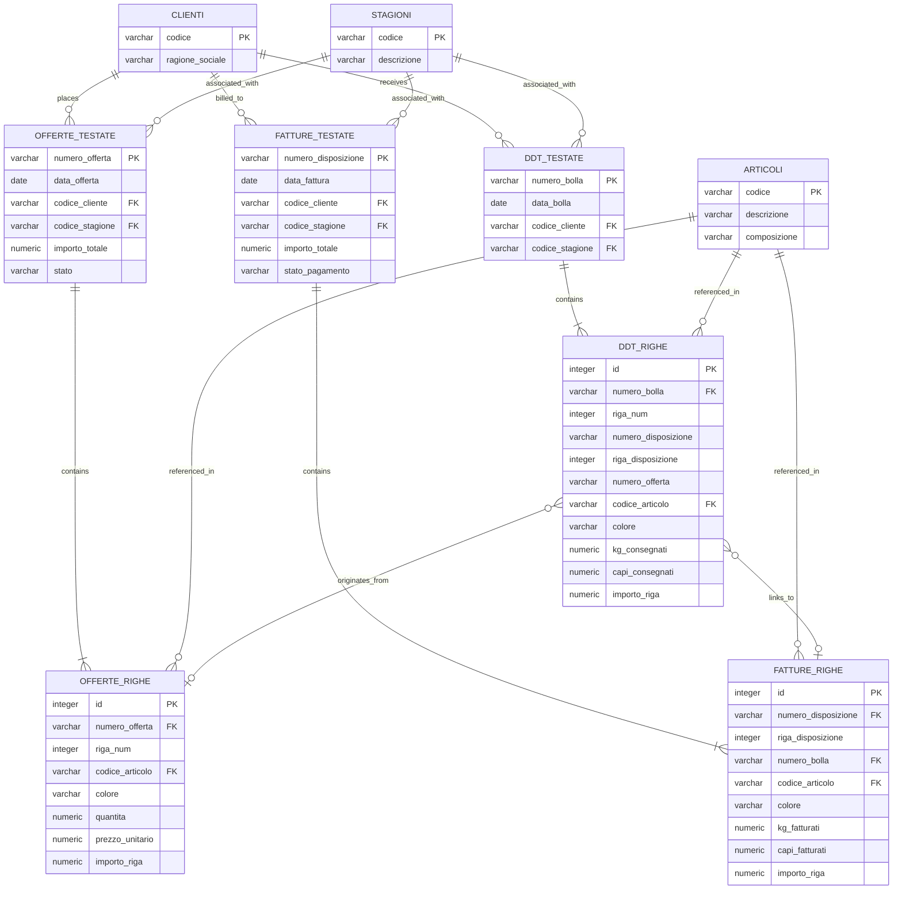

# Data Model Proposal for Intex

This document proposes a simplified, scalable, and high-performance relational database schema for TimescaleDB/PostgreSQL. It is designed to act as a synced local cache of the remote Oracle REST Data Services (ORDS) views and to provide efficient, simple queries to support the frontend application.

---

## 1. Objectives of the Data Model

1. **Syncing Simplicity**: Map directly to the remote Oracle views (e.g., `D02_DDT_TESTATA_001W`, `D03_DDT_RIGHE_001W`, `F07_003W`, `R07_R0236_C012456789_001W`) so that incremental syncing via n8n or Python cron jobs is straightforward.
2. **Frontend Query Efficiency**: Allow fast searching and filtering by Client, Period, and Season (supporting both Guided and Free-text search modes).
3. **Cross-Document Traceability**: Enable easy linking between **Offerte (Offers)**, **Bolle/DDT (Delivery Notes)**, and **Fatture (Invoices)** to support document audits and discrepancy checks.
4. **Scalability**: Leverage indexes and optionally TimescaleDB's hypertables for time-series document records (headers and lines).

---

## 2. Entity-Relationship Diagram



---

## 3. Database Table Definitions (DDL)

### 3.1. Master Data Tables

#### `clienti`
Stores customer identifiers and company names. Maps to Oracle view `R07_R0236_C012456789_001W` (or `R07_R0236`).
```sql
CREATE TABLE clienti (
    codice VARCHAR(50) PRIMARY KEY,
    ragione_sociale VARCHAR(255) NOT NULL
);
CREATE INDEX idx_clienti_ragione_sociale ON clienti (ragione_sociale);
```

#### `stagioni`
Stores seasonal identifiers (e.g., `PE2026`, `AI2025-2026`). Maps to `Z11_STAGIONI`.
```sql
CREATE TABLE stagioni (
    codice VARCHAR(50) PRIMARY KEY,
    descrizione VARCHAR(100) NOT NULL
);
```

#### `articoli`
Stores articles and item details. Maps to `CW1_ARTICOLI_FISCALI` and `CW4_COMPOSIZIONI`.
```sql
CREATE TABLE articoli (
    codice VARCHAR(100) PRIMARY KEY,
    descrizione VARCHAR(255),
    composizione VARCHAR(255)  -- E.g., '80% LI 20% CO'
);
```

---

### 3.2. Document Tables (Headers & Lines)

#### `offerte_testate` & `offerte_righe`
Stores sales quotes/commercial offers. Maps to views like `F03_001W` / `F04_001W`.
```sql
CREATE TABLE offerte_testate (
    numero_offerta VARCHAR(100) PRIMARY KEY,
    data_offerta DATE NOT NULL,
    codice_cliente VARCHAR(50) NOT NULL REFERENCES clienti(codice),
    codice_stagione VARCHAR(50) REFERENCES stagioni(codice),
    importo_totale NUMERIC(12, 2) NOT NULL DEFAULT 0.00,
    stato VARCHAR(50) NOT NULL DEFAULT 'Aperta', -- 'Aperta', 'Accettata', 'Rifiutata'
    created_at TIMESTAMP WITH TIME ZONE DEFAULT CURRENT_TIMESTAMP
);
CREATE INDEX idx_offerte_testate_search ON offerte_testate (codice_cliente, data_offerta, codice_stagione);

CREATE TABLE offerte_righe (
    id SERIAL PRIMARY KEY,
    numero_offerta VARCHAR(100) NOT NULL REFERENCES offerte_testate(numero_offerta) ON DELETE CASCADE,
    riga_num INTEGER NOT NULL,
    codice_articolo VARCHAR(100) REFERENCES articoli(codice),
    colore VARCHAR(100),
    quantita NUMERIC(10, 2) NOT NULL DEFAULT 0,
    prezzo_unitario NUMERIC(10, 4) NOT NULL DEFAULT 0,
    importo_riga NUMERIC(12, 2) NOT NULL DEFAULT 0
);
CREATE UNIQUE INDEX idx_offerte_righe_unique ON offerte_righe (numero_offerta, riga_num);
```

#### `ddt_testate` & `ddt_righe`
Stores delivery notes (Bolle). Maps to `D02_DDT_TESTATA_001W` & `D03_DDT_RIGHE_001W`.
```sql
CREATE TABLE ddt_testate (
    numero_bolla VARCHAR(100) PRIMARY KEY,
    data_bolla DATE NOT NULL,
    codice_cliente VARCHAR(50) NOT NULL REFERENCES clienti(codice),
    codice_stagione VARCHAR(50) REFERENCES stagioni(codice),
    created_at TIMESTAMP WITH TIME ZONE DEFAULT CURRENT_TIMESTAMP
);
CREATE INDEX idx_ddt_testate_search ON ddt_testate (codice_cliente, data_bolla, codice_stagione);

CREATE TABLE ddt_righe (
    id SERIAL PRIMARY KEY,
    numero_bolla VARCHAR(100) NOT NULL REFERENCES ddt_testate(numero_bolla) ON DELETE CASCADE,
    riga_num INTEGER NOT NULL,
    numero_disposizione VARCHAR(100), -- Linked invoice disposition (if billed)
    riga_disposizione INTEGER,
    numero_offerta VARCHAR(100),       -- Linked offer (if originating from quote)
    codice_articolo VARCHAR(100) REFERENCES articoli(codice),
    colore VARCHAR(100),
    kg_consegnati NUMERIC(10, 3) NOT NULL DEFAULT 0.000,
    capi_consegnati NUMERIC(10, 0) NOT NULL DEFAULT 0,
    importo_riga NUMERIC(12, 2) NOT NULL DEFAULT 0.00
);
CREATE UNIQUE INDEX idx_ddt_righe_unique ON ddt_righe (numero_bolla, riga_num);
CREATE INDEX idx_ddt_righe_links ON ddt_righe (numero_disposizione, numero_offerta);
```

#### `fatture_testate` & `fatture_righe`
Stores final invoices (based on disposition numbers). Maps to view `F07_003W`.
```sql
CREATE TABLE fatture_testate (
    numero_disposizione VARCHAR(100) PRIMARY KEY, -- In ERP, "N. disp" acts as invoice group
    data_fattura DATE NOT NULL,
    codice_cliente VARCHAR(50) NOT NULL REFERENCES clienti(codice),
    codice_stagione VARCHAR(50) REFERENCES stagioni(codice),
    importo_totale NUMERIC(12, 2) NOT NULL DEFAULT 0.00,
    stato_pagamento VARCHAR(50) NOT NULL DEFAULT 'Aperta', -- 'Aperta', 'Pagata'
    created_at TIMESTAMP WITH TIME ZONE DEFAULT CURRENT_TIMESTAMP
);
CREATE INDEX idx_fatture_testate_search ON fatture_testate (codice_cliente, data_fattura, codice_stagione);

CREATE TABLE fatture_righe (
    id SERIAL PRIMARY KEY,
    numero_disposizione VARCHAR(100) NOT NULL REFERENCES fatture_testate(numero_disposizione) ON DELETE CASCADE,
    riga_disposizione INTEGER NOT NULL,
    numero_bolla VARCHAR(100) REFERENCES ddt_testate(numero_bolla), -- Reference back to DDT
    codice_articolo VARCHAR(100) REFERENCES articoli(codice),
    colore VARCHAR(100),
    kg_fatturati NUMERIC(10, 3) NOT NULL DEFAULT 0.000,
    capi_fatturati NUMERIC(10, 0) NOT NULL DEFAULT 0,
    importo_riga NUMERIC(12, 2) NOT NULL DEFAULT 0.00
);
CREATE UNIQUE INDEX idx_fatture_righe_unique ON fatture_righe (numero_disposizione, riga_disposizione);
CREATE INDEX idx_fatture_righe_bolla ON fatture_righe (numero_bolla);
```

---

## 4. How the Model Resolves the 10 User Questions

Below are example SQL queries showing how this database structure answers each user requirement in `domande-risposte.txt`.

### 1. Show all invoices for Customer X between January and March
```sql
SELECT f.numero_disposizione, f.data_fattura, f.importo_totale, f.stato_pagamento
FROM fatture_testate f
JOIN clienti c ON f.codice_cliente = c.codice
WHERE (c.codice = :customer_id OR c.ragione_sociale ILIKE :customer_name)
  AND f.data_fattura BETWEEN '2026-01-01' AND '2026-03-31'
ORDER BY f.data_fattura DESC;
```

### 2. Identify open / unpaid invoices for Customer X
```sql
SELECT f.numero_disposizione, f.data_fattura, f.importo_totale
FROM fatture_testate f
JOIN clienti c ON f.codice_cliente = c.codice
WHERE (c.codice = :customer_id OR c.ragione_sociale ILIKE :customer_name)
  AND f.stato_pagamento = 'Aperta'
ORDER BY f.data_fattura ASC;
```

### 3. Total amount invoiced by customer / period / season
```sql
-- Aggregated by customer and season in a specific date range
SELECT c.ragione_sociale, f.codice_stagione, SUM(f.importo_totale) as totale_fatturato
FROM fatture_testate f
JOIN clienti c ON f.codice_cliente = c.codice
WHERE f.data_fattura BETWEEN :data_inizio AND :data_fine
GROUP BY c.ragione_sociale, f.codice_stagione;
```

### 4. Details of Invoice #X (imponibile, VAT, total, date, customer)
*Note: In local database, taxable amount (`imponibile`) is calculated as sum of lines, and VAT is added programmatically or stored as summary fields.*
```sql
SELECT 
    f.numero_disposizione, 
    f.data_fattura, 
    c.ragione_sociale as cliente,
    SUM(r.importo_riga) as imponibile,
    SUM(r.importo_riga) * 0.22 as iva, -- 22% VAT example
    SUM(r.importo_riga) * 1.22 as totale
FROM fatture_testate f
JOIN clienti c ON f.codice_cliente = c.codice
JOIN fatture_righe r ON f.numero_disposizione = r.numero_disposizione
WHERE f.numero_disposizione = :invoice_id
GROUP BY f.numero_disposizione, f.data_fattura, c.ragione_sociale;
```

### 5. Delivery Notes (DDT/Bolle) issued for Customer X in a given period
```sql
SELECT d.numero_bolla, d.data_bolla, c.ragione_sociale
FROM ddt_testate d
JOIN clienti c ON d.codice_cliente = c.codice
WHERE (c.codice = :customer_id OR c.ragione_sociale ILIKE :customer_name)
  AND d.data_bolla BETWEEN :data_inizio AND :data_fine
ORDER BY d.data_bolla DESC;
```

### 6. Find Delivery Notes (DDT) linked to this invoice, offer, or customer
```sql
-- DDTs linked to Invoice disposition '1207'
SELECT DISTINCT d.*
FROM ddt_testate d
JOIN ddt_righe dr ON d.numero_bolla = dr.numero_bolla
WHERE dr.numero_disposizione = '1207';

-- DDTs linked to Offer 'OFF-2026-0142'
SELECT DISTINCT d.*
FROM ddt_testate d
JOIN ddt_righe dr ON d.numero_bolla = dr.numero_bolla
WHERE dr.numero_offerta = 'OFF-2026-0142';
```

### 7. Search offers made to Customer X in season Y or period Z
```sql
SELECT o.numero_offerta, o.data_offerta, o.importo_totale, o.stato
FROM offerte_testate o
JOIN clienti c ON o.codice_cliente = c.codice
WHERE (c.codice = :customer_id OR c.ragione_sociale ILIKE :customer_name)
  AND (o.codice_stagione = :season_code OR o.data_offerta BETWEEN :data_inizio AND :data_fine)
ORDER BY o.data_offerta DESC;
```

### 8. Which offers are accepted, rejected, or still open?
```sql
SELECT o.numero_offerta, o.data_offerta, c.ragione_sociale, o.importo_totale, o.stato
FROM offerte_testate o
JOIN clienti c ON o.codice_cliente = c.codice
WHERE o.stato = :status -- 'Accettata', 'Rifiutata', 'Aperta'
ORDER BY o.data_offerta DESC;
```

### 9. Compare Offer, DDT, and Invoice for discrepancies (Critical Value Check)
This queries compares quantities and amounts proposed in the offer vs. delivered in DDTs vs. billed in the final invoice for a specific customer or processing.
```sql
SELECT 
    art.descrizione AS articolo,
    dr.colore,
    -- Offer details
    COALESCE(SUM(o_rig.quantita), 0) AS capi_offerti,
    COALESCE(SUM(o_rig.importo_riga), 0) AS valore_offerto,
    -- DDT details
    COALESCE(SUM(dr.capi_consegnati), 0) AS capi_consegnati,
    COALESCE(SUM(dr.importo_riga), 0) AS valore_consegnato,
    -- Invoice details
    COALESCE(SUM(fr.capi_fatturati), 0) AS capi_fatturati,
    COALESCE(SUM(fr.importo_riga), 0) AS valore_fatturato,
    -- Discrepancies
    (COALESCE(SUM(dr.capi_consegnati), 0) - COALESCE(SUM(fr.capi_fatturati), 0)) AS diff_capi_consegna_fattura
FROM ddt_righe dr
JOIN ddt_testate dt ON dr.numero_bolla = dt.numero_bolla
LEFT JOIN articoli art ON dr.codice_articolo = art.codice
LEFT JOIN fatture_righe fr ON dr.numero_disposizione = fr.numero_disposizione 
                           AND dr.codice_articolo = fr.codice_articolo 
                           AND dr.colore = fr.colore
LEFT JOIN offerte_righe o_rig ON dr.numero_offerta = o_rig.numero_offerta 
                              AND dr.codice_articolo = o_rig.codice_articolo 
                              AND dr.colore = o_rig.colore
WHERE dt.codice_cliente = :customer_id
GROUP BY art.descrizione, dr.colore;
```

### 10. Generate CSV export for filtered results
Since all tables are standardized and cleanly joined, generating flat exports is extremely fast. We can run simple queries and serialize them into CSV format directly from the backend.

---

## 5. Syncing Strategy with Remote Views

A Python script should execute a periodic sync (e.g. daily, hourly) pulling from the ORDS endpoints. 

1. **Incremental Updates**: Using filters like `last_updated_at` or querying Oracle REST filters (`?q={"DATA_BOLLA_CLI_ISO":{"$gt":"2026-06-01"}}`).
2. **Upsert Logic (INSERT ... ON CONFLICT DO UPDATE)**:
   For example, when fetching a delivery note from Oracle:
   ```sql
   INSERT INTO ddt_testate (numero_bolla, data_bolla, codice_cliente, codice_stagione)
   VALUES (%s, %s, %s, %s)
   ON CONFLICT (numero_bolla) DO UPDATE SET
       data_bolla = EXCLUDED.data_bolla,
       codice_cliente = EXCLUDED.codice_cliente,
       codice_stagione = EXCLUDED.codice_stagione;
   ```

---

## 6. TimescaleDB Optimization & Scalability

Since document entries (offers, delivery notes, and invoices) grow sequentially over time, we can optimize search speeds on large volumes of data using **TimescaleDB Hypertables**:

- By partitioning the **lines/rows** tables (`ddt_righe`, `fatture_righe`, `offerte_righe`) by transaction time/date (linked via header dates), we achieve automatic chunking.
- Queries filtering by date ranges (e.g., Question 1 and Question 5) will only scan relevant memory chunks instead of the entire table.

To set up hypertables on line items, we include the date directly in the line tables and run:
```sql
-- Convert ddt_righe and fatture_righe to hypertables based on date columns
SELECT create_hypertable('ddt_righe', 'data_bolla');
SELECT create_hypertable('fatture_righe', 'data_fattura');
```
This guarantees sub-millisecond response times even with millions of document lines.
