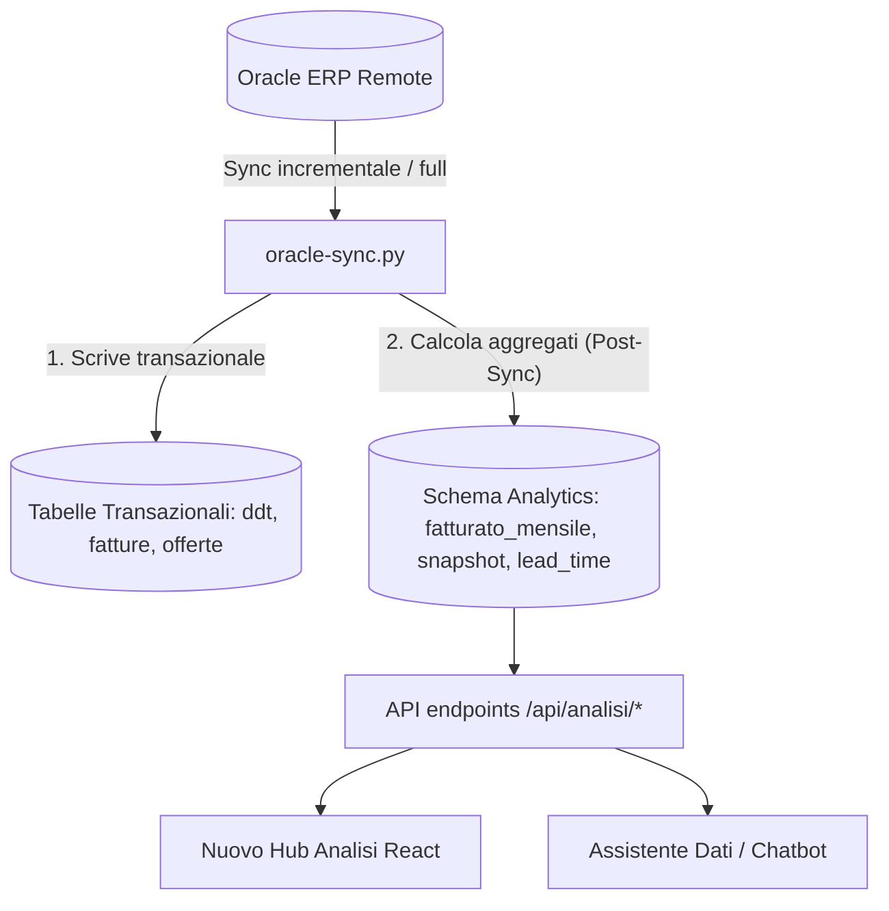

# Analisi dei Dati e Proposta per il Layer Analytics (Intex CRM)

Questo documento propone una soluzione architetturale scalabile e ad alte prestazioni per rispondere alle **32 domande gestionali** definite in [domande2.txt](file:///Users/globalbit/Code/intex/documentation/domande2.txt). 

L'obiettivo è abilitare sia l'interfaccia React (frontend) sia l'assistente dati LLM (chatbot) a interrogare ed elaborare risposte complesse in millisecondi, evitando calcoli pesanti a runtime sulle tabelle transazionali e strutturando un layer di aggregazione pre-calcolato.

---

## 1. Sintesi Esecutiva & Strategia di Scalabilità

Le domande presentate in `domande2.txt` segnano una transizione critica:
* **Da:** Domande transazionali e puntuali (es. *"mostrami la bolla X"*, *"quali offerte sono aperte per il cliente Y"*).
* **A:** Domande analitiche, trend temporali, auditing incrociato e score predittivi/euristici (es. *"chi sono i clienti dormienti"*, *"lead time medio negli ultimi 24 mesi"*, *"stress test sulle vendite"*).

Eseguire query SQL con aggregazioni e window functions sulle tabelle transazionali normalizzate (`fatture_righe`, `ddt_righe`, `offerte_righe`) a ogni richiesta dell'utente o dell'LLM causerebbe:
1. **Latenza elevata** all'aumentare dei record storici (milioni di righe di dettaglio).
2. **Pressione sul database** in caso di accessi concorrenti.
3. **Incoerenza delle risposte dell'LLM**, che dovrebbe improvvisare calcoli complessi (`SUM`, `AVG`, `GROUP BY`) o estrarre migliaia di record nel contesto.

### La Soluzione: Schema Analytics Pre-Calcolato
Si propone di introdurre un insieme di tabelle analitiche aggregate (**Data Marts**), separate dallo schema transazionale, popolate in modalità batch al termine di ogni esecuzione del processo di sincronizzazione (`oracle-sync.py`).



---

## 1.1 Domande escluse dal perimetro (dati non disponibili nel database attuale)

Le seguenti domande **non sono risolvibili con il modello dati attuale**: richiedono dati che non esistono nel database locale (e in alcuni casi nemmeno negli endpoint ORDS oggi sincronizzati). Per scelta, **non vengono considerate** nelle soluzioni, nelle tabelle analytics, negli endpoint o nella roadmap. Sono raccolte qui con il dato mancante e l'eventuale condizione di sblocco.

| # | Domanda | Dato mancante nel DB attuale | Sblocco |
| :--- | :--- | :--- | :--- |
| **Q10** | Tempo medio di pagamento (giorni fattura → incasso) | Nessun dato di incasso/scadenziario; `stato_pagamento` rimosso dallo schema | Solo se l'ERP espone un endpoint pagamenti / partite aperte |
| **Q14** | Ordini aperti e da quanti giorni | Nessun flag aperto/chiuso locale. Le `offerte_testate` sono **derivate dalle righe DDT**, quindi un anti-join offerte ↔ DDT è privo di significato (sarebbe sempre vuoto) | Richiede sync di `d03_flag_chiusa` / `ew1_flag_chiuso` |
| **Q17** | Lavorazioni che assorbono più tempo/volume | `cd_lavorazione` / `ds_lavorazione` non presenti in `fatture_righe`/`ddt_righe` | Richiede estensione sync (campi esistono in `F07_003W`) |
| **Q18** | Lavorazioni rifatte o con più ritardi | Nessun tracciamento delle rilavorazioni + `cd_lavorazione` mancante | Richiede dato di rilavorazione (non disponibile in ORDS) |
| **Q23** | Ordini chiusi senza DDT | Nessun flag di chiusura; offerte derivate dalle righe DDT (anti-join privo di senso) | Richiede sync di `flag_chiusa` |
| **Q24** | Prezzo medio per lavorazione sotto media / margine | `cd_lavorazione` mancante; nessun dato di **costo** per calcolare il margine | Richiede sync lavorazione + dati di costo |
| **Q29** | Tanto fatturato ma margini bassi / pagamenti lunghi | Nessun dato di **costo** (margine) né di **incasso** (pagamenti) | Richiede dati costo + pagamenti dall'ERP |

### Domande mantenute ma in forma ridotta ai dati disponibili

Queste restano nel perimetro, ma **solo per la parte coperta dai dati presenti**; la dimensione mancante è ignorata:

* **Q9** — risolta per **articolo / capo** (`codice_articolo`, `articoli.descrizione`), **non** per tipo di lavorazione.
* **Q25** — storico prezzo per **articolo** (da `fatture_righe`: `importo_riga / capi_fatturati` nel tempo), non per lavorazione.
* **Q28** — score «cliente ideale» calcolato su **fatturato + lead time**; la dimensione pagamenti è esclusa (vedi Q10).

---

## 2. Modello Dati Proposto (Schema `analytics`)

Le tabelle descritte di seguito verranno create nello schema di database locale. I calcoli saranno interamente a carico dello script di sincronizzazione, rendendo le letture del frontend istantanee.

> **Revisione di scalabilità (vedi §9).** A questa scala reale (poche centinaia di clienti, fatti dell'ordine di 10⁴–10⁵ righe) la motivazione delle mart tables **non è la performance** — un `GROUP BY` indicizzato risponde in millisecondi — ma la **determinismo per l'LLM**. Per questo si raccomanda di implementare gli aggregati come **`MATERIALIZED VIEW`** (`clienti_fatturato_mensile`, `clienti_fatturato_stagionale`, `lead_time_mensile`, volumi) e gli oggetti derivati come **`VIEW`** semplici (`clienti_snapshot`, anomalie strutturali). Il DDL `CREATE TABLE` sotto resta valido come riferimento dei campi, ma l'implementazione consigliata sostituisce gran parte del codice `rebuild_*()` con un singolo `REFRESH MATERIALIZED VIEW CONCURRENTLY` a fine sync.

### 2.1 Tabella `clienti_fatturato_mensile`
Rappresenta l'aggregazione principale del fatturato per cliente su base mensile. Risolve i trend storici e i calcoli di concentrazione.

```sql
CREATE SCHEMA IF NOT EXISTS analytics;

CREATE TABLE analytics.clienti_fatturato_mensile (
    codice_cliente     VARCHAR(50) NOT NULL REFERENCES clienti(codice) ON DELETE CASCADE,
    anno               INTEGER NOT NULL,
    mese               INTEGER NOT NULL,
    totale_fatturato   NUMERIC(14, 2) NOT NULL DEFAULT 0.00,
    numero_fatture     INTEGER NOT NULL DEFAULT 0,
    capi_fatturati     INTEGER NOT NULL DEFAULT 0,
    kg_fatturati       NUMERIC(12, 3) NOT NULL DEFAULT 0.000,
    updated_at         TIMESTAMP WITH TIME ZONE DEFAULT CURRENT_TIMESTAMP,
    PRIMARY KEY (codice_cliente, anno, mese)
);

CREATE INDEX idx_cli_fatt_mensile_data ON analytics.clienti_fatturato_mensile (anno, mese);
```

### 2.2 Tabella `clienti_fatturato_stagionale`
Il settore tessile ragiona prevalentemente per stagioni (es. Primavera/Estate `PE`, Autunno/Inverno `AI`). Questa tabella memorizza i dati aggregati per stagione.

```sql
CREATE TABLE analytics.clienti_fatturato_stagionale (
    codice_cliente     VARCHAR(50) NOT NULL REFERENCES clienti(codice) ON DELETE CASCADE,
    codice_stagione    VARCHAR(50) NOT NULL REFERENCES stagioni(codice) ON DELETE CASCADE,
    totale_fatturato   NUMERIC(14, 2) NOT NULL DEFAULT 0.00,
    numero_fatture     INTEGER NOT NULL DEFAULT 0,
    capi_fatturati     INTEGER NOT NULL DEFAULT 0,
    kg_fatturati       NUMERIC(12, 3) NOT NULL DEFAULT 0.000,
    updated_at         TIMESTAMP WITH TIME ZONE DEFAULT CURRENT_TIMESTAMP,
    PRIMARY KEY (codice_cliente, codice_stagione)
);
```

### 2.3 Tabella `clienti_snapshot`
Una tabella di riepilogo "one-row-per-customer" aggiornata all'ultimo sync. Raccoglie metriche di frequenza, erosione e stato di attività, evitando scansioni storiche.

```sql
CREATE TABLE analytics.clienti_snapshot (
    codice_cliente                   VARCHAR(50) PRIMARY KEY REFERENCES clienti(codice) ON DELETE CASCADE,
    data_primo_ordine                DATE,
    data_ultimo_ordine               DATE,
    giorni_dall_ultimo_ordine        INTEGER,
    ordini_ytd                       INTEGER,           -- Year To Date
    valore_medio_ordine_ytd          NUMERIC(12, 2),
    intervallo_medio_giorni_corrente NUMERIC(6, 1),     -- Ultimi 12 mesi
    intervallo_medio_giorni_prec     NUMERIC(6, 1),     -- Anno precedente (per Q5)
    fatturato_rolling_12m            NUMERIC(14, 2),
    fatturato_anno_precedente        NUMERIC(14, 2),
    fatturato_semestre_corrente      NUMERIC(14, 2),
    fatturato_semestre_yoy           NUMERIC(14, 2),    -- Stesso semestre anno scorso (per Q3)
    rank_fatturato_12m               INTEGER,
    percentuale_sul_totale_12m       NUMERIC(5, 2),     -- Peso percentuale sul fatturato aziendale
    is_dormiente                     BOOLEAN DEFAULT FALSE, -- Attivo nei 12m precedenti ma fermo da >90gg
    is_nuovo_12m                     BOOLEAN DEFAULT FALSE,
    stagioni_attive                  VARCHAR(50)[],     -- Elenco stagioni in cui ha ordinato (per Q31)
    updated_at                       TIMESTAMP WITH TIME ZONE DEFAULT CURRENT_TIMESTAMP
);

CREATE INDEX idx_cli_snapshot_rank ON analytics.clienti_snapshot (rank_fatturato_12m);
```

> **Semplificazione consigliata:** per poche centinaia di clienti, `clienti_snapshot` può essere una **`VIEW`** che legge dalle MV del fatturato (più `offerte_testate` per le date ordine), invece di una tabella da ricostruire. Niente persistenza, sempre coerente. La colonna pagamenti è esclusa (Q10 fuori perimetro).

### 2.4 Tabella `lead_time_documenti` & `lead_time_mensile`
Traccia i tempi di attraversamento della produzione per cartellino/ordine (lead time reale).

```sql
-- Dettaglio per singolo documento (ordine / DDT)
CREATE TABLE analytics.lead_time_documenti (
    numero_offerta     VARCHAR(100) PRIMARY KEY REFERENCES offerte_testate(numero_offerta) ON DELETE CASCADE,
    codice_cliente     VARCHAR(50) NOT NULL REFERENCES clienti(codice) ON DELETE CASCADE,
    data_entrata       DATE NOT NULL, -- ew1_data_bolla_cli (bolla in entrata del cliente)
    data_uscita        DATE NOT NULL, -- data della bolla di consegna in uscita
    lead_time_giorni   INTEGER NOT NULL,
    codice_stagione    VARCHAR(50),
    updated_at         TIMESTAMP WITH TIME ZONE DEFAULT CURRENT_TIMESTAMP
);

CREATE INDEX idx_lt_doc_cliente ON analytics.lead_time_documenti (codice_cliente);

-- Aggregato mensile aziendale e per cliente per trend
CREATE TABLE analytics.lead_time_mensile (
    codice_cliente     VARCHAR(50) NOT NULL REFERENCES clienti(codice) ON DELETE CASCADE,
    anno               INTEGER NOT NULL,
    mese               INTEGER NOT NULL,
    lead_time_medio    NUMERIC(6, 2) NOT NULL,
    numero_ordini      INTEGER NOT NULL,
    updated_at         TIMESTAMP WITH TIME ZONE DEFAULT CURRENT_TIMESTAMP,
    PRIMARY KEY (codice_cliente, anno, mese)
);
```

> **Semplificazione consigliata:** `lead_time_mensile` è una semplice aggregazione di `lead_time_documenti` → implementarla come **`VIEW`** (o MV) e mantenere persistito solo `lead_time_documenti`. `data_entrata` usa `offerte_testate.data_offerta` (derivata da `ew1_data_bolla_cli`), `data_uscita` usa `ddt_testate.data_bolla`, collegate via `numero_offerta`.

### 2.5 Tabella `anomalie_rilevate`
Raccoglie i risultati di controlli e auditing (DDT non fatturati, ordini senza DDT, discrepanze). Consente all'LLM di rispondere a domande riassuntive (es. Domanda 32) leggendo poche righe pre-compilate.

```sql
CREATE TABLE analytics.anomalie_rilevate (
    id                 SERIAL PRIMARY KEY,
    tipo_anomalia      VARCHAR(100) NOT NULL, -- 'ddt_non_fatturato_60g', 'fattura_senza_ddt', 'ordine_chiuso_senza_ddt'
    codice_cliente     VARCHAR(50) REFERENCES clienti(codice) ON DELETE CASCADE,
    codice_documento   VARCHAR(100),          -- numero bolla, numero disposizione, ecc.
    valore_stimato     NUMERIC(12, 2) DEFAULT 0.00,
    descrizione        TEXT,
    giorni_ritardo     INTEGER,
    rilevata_il        DATE DEFAULT CURRENT_DATE,
    trimestre          VARCHAR(7) NOT NULL,   -- es. '2026-Q2'
    severita           INTEGER DEFAULT 1      -- scala 1 (basso) a 5 (critico)
);

CREATE INDEX idx_anomalie_trimestre ON analytics.anomalie_rilevate (trimestre, severita DESC);
```

> **Semplificazione consigliata:** le anomalie **strutturali** (Q19, Q20, Q22) sono semplici anti-join → esporle come **`VIEW` live** (sempre fresche, nessun percorso di scrittura). Persistere `anomalie_rilevate` **solo** per la sintesi trimestrale curata (Q32). Le regole euristiche di Q18/Q24/Q25-per-lavorazione restano fuori perimetro perché dipendono da `cd_lavorazione` (vedi §1.1).

### 2.6 Tabella `sync_meta` (Metadati per UI e tracciamento)
Memorizza informazioni sull'ultimo rebuild analitico per permettere al frontend di mostrare la data dell'ultimo aggiornamento calcolato.

```sql
CREATE TABLE analytics.sync_meta (
    job_name           VARCHAR(100) PRIMARY KEY,
    last_success       TIMESTAMP WITH TIME ZONE,
    last_error         TEXT,
    rows_affected      INTEGER,
    elapsed_seconds    NUMERIC(8, 2)
);
```

---

## 3. Considerazioni Critiche da `cursor-analyses.md`

### 3.1 Workaround per la Mancanza di `Z11_STAGIONI`
Il database remoto di Oracle ha rimosso l'endpoint delle stagioni (`Z11_STAGIONI` restituisce 404). Per popolare correttamente la tabella `stagioni` locale:
* **Strategia:** Estrarre dinamicamente i codici stagione unici direttamente dai record di fattura (`F07_003W`) tramite il campo `ew2_cd_stagione`.
* **Mapping dei Codici (Aliasing):** Il backend deve utilizzare il modulo [stagioni_aliases.py](file:///Users/globalbit/Code/intex/backend/stagioni_aliases.py) per mappare i codici legacy di Oracle (es. `PE 26`, `AI 26`) in codici amichevoli per la UI e l'LLM (es. `PE2026`, `AI25-26`).

### 3.2 Propagazione dei Codici Stagione (Season Backfilling)
Molte righe DDT in Oracle (`D03_DDT_RIGHE_002W`) non espongono direttamente il codice stagione. Se non corretto, questo genera record orfani e impedisce il filtraggio analitico delle bolle o delle offerte per stagione.
* **Soluzione:** Popolare `codice_stagione` su `ddt_testate` e `offerte_testate` propagando i dati in cascata:
  $$\text{Fatture (con stagione)} \rightarrow \text{Bolle (tramite righe collegate)} \rightarrow \text{Offerte (tramite righe DDT)}$$
  Questa operazione deve essere integrata stabilmente a livello transazionale prima dell'inizio del calcolo dell'analytics.

### 3.3 Colonne Mancanti in `fatture_righe` (Lavorazioni)
Le domande **9, 17, 24, 25** dipendono dal tipo di lavorazione applicata. L'endpoint ORDS `F07_003W` espone i campi `cd_lavorazione` e `ds_lavorazione`, ma l'attuale schema locale del database in [create-tables.sql](file:///Users/globalbit/Code/intex/data/migrations/create-tables.sql#L83) **non include questi campi** in `fatture_righe`.
* **Prerequisito:** È bloccante estendere prima la tabella transazionale locale `fatture_righe` con:
  ```sql
  ALTER TABLE fatture_righe ADD COLUMN cd_lavorazione VARCHAR(50);
  ALTER TABLE fatture_righe ADD COLUMN ds_lavorazione VARCHAR(255);
  ```
  Quindi allineare il caricamento in `oracle-sync.py` per popolare questi campi prima di calcolare la tabella `cliente_lavorazioni_top` analitica.
  *Nota: finché questo sync non esiste, le domande Q17/Q24 (e la parte «lavorazione» di Q9/Q25) restano fuori perimetro — vedi §1.1.*

### 3.4 `data_fattura` rappresenta la data di **consegna**, non di fatturazione
Lo sync popola `fatture_testate.data_fattura` da `data_bolla_iso` / `d02_dt_bolla` (data bolla), non da `dt_fattura_iso`. Di conseguenza **ogni aggregazione mensile/semestrale/trend** (Q1, Q3, Q15, Q26) è in realtà «per mese di consegna», non «di fatturazione».
* **Decisione necessaria (a basso costo):** o si dichiara che la grana è la consegna e si rinomina il campo di competenza (es. `mese_competenza`), oppure si corregge il sync per usare `dt_fattura_iso`. Va deciso **prima** di costruire le serie storiche, altrimenti tutti i KPI sono etichettati in modo fuorviante.

### 3.5 Fonte unica per il volume (Q15 e Q16)
Q15 e Q16 devono usare la **stessa** definizione di volume. Il volume di produzione reale è quello **consegnato** in `ddt_righe` (`kg_consegnati`, `capi_consegnati`), non i kg fatturati. Un'unica vista volume su `ddt_righe` (grana giorno/settimana) copre sia il rollup mensile (Q15) sia il confronto settimanale YoY (Q16): non servono due tabelle separate né mischiare kg fatturati e consegnati.

---

## 4. Integrazione nel Processo di Sincronizzazione (`oracle-sync.py`)

Per garantire la consistenza dei dati senza degradare le performance a runtime, lo script `oracle-sync.py` deve includere una fase finale di ricostruzione analitica (`rebuild_analytics_layer`) inserita subito dopo il completamento dei sync transazionali.

> **Semplificazione consigliata (vedi §9.2):** in v1 usare un **full refresh** ad ogni sync, non un rebuild incrementale. A questa scala il ricalcolo completo richiede meno di un secondo, mentre l'invalidazione incrementale «solo i mesi modificati» (citata sotto ma senza meccanismo: nessun watermark/dirty-set) è la parte più facile da sbagliare. Con l'approccio `MATERIALIZED VIEW`, la fase si riduce a una sequenza di `REFRESH MATERIALIZED VIEW CONCURRENTLY` dentro un'unica transazione.

### Sicurezza Transazionale e Concurrency
Dal momento che l'applicazione Bottle serve query API in tempo reale mentre lo script di sincronizzazione aggiorna le tabelle analitiche:
1. **Uso di Transazioni Atomiche:** Tutte le query all'interno di ciascuna fase analitica devono essere eseguite all'interno di un unico blocco `BEGIN ... COMMIT` per evitare di esporre tabelle parzialmente popolate all'API.
2. **Locking dei Processi:** Il rebuild analitico deve riutilizzare lo stesso meccanismo di file/db lock del processo di sync per impedire esecuzioni concorrenti sovrapposte.

```python
def rebuild_analytics_layer(cursor, mode="incremental"):
    """
    Eseguito al termine del sync.
    In modalità incremental, ricalcola solo i clienti e i mesi che hanno subito modifiche
    nei dati transazionali durante l'esecuzione corrente.
    In modalità full, ricalcola l'intera serie storica (es. ultimi 3 anni).
    """
    print("\n--- Ricostruzione Layer Analytics ---")
    start_time = time.time()
    
    try:
        # Esegui tutto in una transazione isolata
        # 1. Ricalcolo fatturato mensile
        rebuild_fatturato_mensile(cursor)
        
        # 2. Ricalcolo fatturato stagionale
        rebuild_fatturato_stagionale(cursor)
        
        # 3. Ricalcolo tempi di consegna (lead_time)
        rebuild_lead_time(cursor)
        
        # 4. Aggiornamento snapshot clienti (dipende dai punti precedenti)
        rebuild_clienti_snapshot(cursor)
        
        # 5. Generazione anomalie rule-based (Auditing)
        detect_anomalie(cursor)
        
        elapsed = time.time() - start_time
        cursor.execute(
            """
            INSERT INTO analytics.sync_meta (job_name, last_success, rows_affected, elapsed_seconds)
            VALUES ('rebuild_analytics', NOW(), NULL, %s)
            ON CONFLICT (job_name) DO UPDATE SET
                last_success = EXCLUDED.last_success,
                last_error = NULL,
                elapsed_seconds = EXCLUDED.elapsed_seconds;
            """,
            (elapsed,)
        )
    except Exception as e:
        cursor.execute(
            """
            INSERT INTO analytics.sync_meta (job_name, last_error)
            VALUES ('rebuild_analytics', %s)
            ON CONFLICT (job_name) DO UPDATE SET
                last_error = EXCLUDED.last_error;
            """,
            (str(e),)
        )
        raise e
```

---

## 5. API Endpoints Proposti per Frontend e LLM

Invece di far scrivere all'LLM query SQL complesse (che portano a errori di sintassi o allucinazioni), il backend esporrà endpoint API deterministici strutturati che restituiscono i dati pre-aggregati.

| Endpoint | Descrizione | Risolve Domande |
| :--- | :--- | :--- |
| `GET /api/analisi/fatturato/mensile` | Trend fatturato globale o per cliente filtrato per data. | Q26 |
| `GET /api/analisi/clienti/ranking` | Lista clienti ordinata per fatturato rolling 12m con % sul totale. | Q1 |
| `GET /api/analisi/clienti/concentrazione` | Calcolo quota dei primi 5/10 clienti confrontata con N anni fa. | Q2 |
| `GET /api/analisi/clienti/erosione` | Clienti con calo fatturato semestre YoY o con allungamento intervallo ordini. | Q3, Q5 |
| `GET /api/analisi/clienti/dormienti` | Clienti inattivi da >90 giorni ma attivi nei 12m precedenti. | Q4 |
| `GET /api/analisi/clienti/nuovi` | Clienti con prima fattura negli ultimi 12 mesi e relativo fatturato. | Q8 |
| `GET /api/analisi/produzione/lead-time` | Trend del lead time e classifica ordini con attraversamento più lungo. | Q11, Q12, Q13 |
| `GET /api/analisi/produzione/volumi` | Volumi settimanali/mensili e picchi stagionali di lavorazione. | Q15, Q16 |
| `GET /api/analisi/controllo/anomalie` | DDT non fatturati da 60g, discrepanze e fatture orfane. | Q19, Q20, Q22, Q32 |
| `GET /api/analisi/clienti/qualita` | Lista clienti per score ridotto (fatturato + lead time). | Q28 *(senza pagamenti)* |
| `POST /api/analisi/simulazioni/stress-test` | Simula un calo di fatturato (es. -20% sui primi 3 clienti). | Q30 |

---

## 6. Proposta UI: Hub "Analisi & Cruscotto Gestionale"

Si sconsiglia di creare una pagina focalizzata esclusivamente sul fatturato. Per coprire l'ampiezza delle domande di produzione, efficienza ed auditing, è ottimale realizzare una nuova voce di menu principale denominata **"Analisi"** strutturata in schede (Tab):

```
[ Menu Principale: Bolle | Fatture | Ordini | Discrepanze | ANALISI (Nuovo) ]
--------------------------------------------------------------------------------
[ Tab 1: Performance Clienti ] [ Tab 2: Produzione ] [ Tab 3: Controllo Perdite ] [ Tab 4: Simulatore & Opportunità ]
```

### Tab 1: Performance & Trend Clienti
* **Grafico a linee:** Andamento del fatturato totale mensile negli ultimi 24 mesi (Q26).
* **Tabella Ranking Top 10:** Ragione sociale, fatturato 12m, percentuale sul totale aziendale (Q1) e indicatore di tendenza.
* **Widget Concentrazione:** Grafico a torta con la quota dei primi 5 clienti e confronto storico dinamico con 2 anni fa (Q2).
* **Sezione Clienti a Rischio (Erosione):** Grid che elenca i clienti dormienti (Q4), clienti in erosione semestrale (Q3) e chi sta allungando i tempi medi di acquisto (Q5).
* **Widget Clienti Nuovi:** Conteggio e lista dei clienti acquisiti negli ultimi 12 mesi con il fatturato generato (Q8).

### Tab 2: Efficienza e Volumi Produttivi
* **Grafico Lead Time:** Trend del lead time medio mensile (in giorni) degli ultimi 24 mesi (Q12).
* **Tabella Colli di Bottiglia:** Elenco dei 10 ordini con il tempo di attraversamento più lungo nell'ultimo trimestre (Q13). *(Q14 «ordini aperti» è esclusa — vedi §1.1.)*
* **Grafico a Barre dei Volumi:** Visualizzazione del volume settimanale/mensile in kg e capi lavorati (Q15), con overlay di confronto sullo stesso periodo dell'anno precedente (Q16).

### Tab 3: Controllo Perdite & Auditing (Loss Prevention)
* **KPI Principale:** Valore totale stimato delle consegne effettuate (DDT) ma non ancora fatturate da oltre 60 giorni (Q19, Q20).
* **Elenco DDT Sospesi:** Tabella con filtro per cliente dei DDT senza fattura (Q19).
* **Audit Documentale:** Elenco delle fatture emesse senza DDT o ordine collegato (Q22). *(Q23 «ordini chiusi senza DDT» è esclusa — vedi §1.1.)*

### Tab 4: Simulatore & Opportunità
* **Stress Test Interattivo (Q30):** Uno slider che permette all'amministratore di impostare una percentuale di calo degli ordini (es. `-20%`) e un selettore per i primi N clienti. Il sistema ricalcola l'impatto sul volo e mostra quali mesi dell'anno sarebbero commercialmente più colpiti.
* **Matrice Clienti Ideali (Q28, in forma ridotta):** Un grafico a dispersione (Scatter Plot):
  - Asse X: Fatturato 12m.
  - Asse Y: Lead time di produzione (la velocità di pagamento è esclusa — vedi Q10/§1.1).
  - Riquadri: *Clienti da fidelizzare* (alto fatturato, produzione efficiente). *(Q29 «clienti faticosi» è esclusa: mancano margine e pagamenti.)*
* **Card "Insight del Trimestre" (Q32):** Pannello riassuntivo che mostra le 3 anomalie più gravi o le opportunità rilevate dal layer di calcolo negli ultimi 3 mesi.

---

## 7. Mappatura Domanda → Soluzione Tecnica (Domande 1-32)

Di seguito viene descritto l'approccio tecnico e la logica SQL per rispondere a ciascuna delle domande di `domande2.txt` in modo scalabile.

### Sezione 1. Capire i clienti

#### Q1: Primi 10 clienti per fatturato negli ultimi 12 mesi, con percentuale sul totale.
* **Soluzione:** Query sulla tabella `clienti_snapshot` (pre-calcolata) o su `clienti_fatturato_mensile`.
* **SQL:**
```sql
SELECT 
    c.ragione_sociale,
    s.fatturato_rolling_12m AS fatturato,
    s.percentuale_sul_totale_12m AS percentuale
FROM analytics.clienti_snapshot s
JOIN clienti c ON s.codice_cliente = c.codice
ORDER BY s.fatturato_rolling_12m DESC
LIMIT 10;
```

#### Q2: Quota di fatturato nei primi 5 clienti rispetto a 2 anni fa.
* **Soluzione:** Calcolato a runtime su `clienti_fatturato_mensile` (molto leggero).
* **⚠️ Nota di correttezza:** preferire **finestre rolling a 12 mesi** (ultimi 12 mesi vs finestra 24–12 mesi fa) invece di anni civili hardcoded; l'SQL sotto con `anno = 2026 / 2024` è fragile se eseguito a metà anno e va parametrizzato.
* **SQL (Runtime su mensile):**
```sql
WITH fatturato_periodi AS (
    SELECT 
        codice_cliente,
        SUM(CASE WHEN anno = 2026 THEN totale_fatturato ELSE 0 END) AS fat_corrente,
        SUM(CASE WHEN anno = 2024 THEN totale_fatturato ELSE 0 END) AS fat_due_anni_fa
    FROM analytics.clienti_fatturato_mensile
    GROUP BY codice_cliente
),
totale_aziendale AS (
    SELECT 
        SUM(fat_corrente) AS tot_corrente,
        SUM(fat_due_anni_fa) AS tot_due_anni_fa
    FROM fatturato_periodi
),
ranking_corrente AS (
    SELECT codice_cliente, fat_corrente, ROW_NUMBER() OVER (ORDER BY fat_corrente DESC) as rn FROM fatturato_periodi
),
ranking_passato AS (
    SELECT codice_cliente, fat_due_anni_fa, ROW_NUMBER() OVER (ORDER BY fat_due_anni_fa DESC) as rn FROM fatturato_periodi
)
SELECT 
    ROUND(100.0 * (SELECT SUM(fat_corrente) FROM ranking_corrente WHERE rn <= 5) / (SELECT tot_corrente FROM totale_aziendale), 2) AS quota_top5_oggi,
    ROUND(100.0 * (SELECT SUM(fat_due_anni_fa) FROM ranking_passato WHERE rn <= 5) / (SELECT tot_due_anni_fa FROM totale_aziendale), 2) AS quota_top5_due_anni_fa;
```

#### Q3: Clienti che hanno fatturato meno in questo semestre rispetto allo stesso dell'anno scorso.
* **Soluzione:** Letto direttamente da `clienti_snapshot.fatturato_semestre_corrente` confrontato con `fatturato_semestre_yoy`.
* **SQL:**
```sql
SELECT 
    c.ragione_sociale,
    s.fatturato_semestre_yoy AS fatturato_anno_scorso,
    s.fatturato_semestre_corrente AS fatturato_attuale,
    (s.fatturato_semestre_yoy - s.fatturato_semestre_corrente) AS calo_assoluto,
    ROUND(100.0 * (s.fatturato_semestre_yoy - s.fatturato_semestre_corrente) / NULLIF(s.fatturato_semestre_yoy, 0), 2) AS calo_percentuale
FROM analytics.clienti_snapshot s
JOIN clienti c ON s.codice_cliente = c.codice
WHERE s.fatturato_semestre_corrente < s.fatturato_semestre_yoy
ORDER BY calo_assoluto DESC;
```

#### Q4: Clienti "dormienti" (nessun ordine da 90 giorni ma attivi nei 12 mesi precedenti).
* **Soluzione:** Filtro diretto sul flag `is_dormiente` della tabella `clienti_snapshot`.
* **SQL:**
```sql
SELECT c.ragione_sociale, s.data_ultimo_ordine, s.giorni_dall_ultimo_ordine, s.fatturato_rolling_12m
FROM analytics.clienti_snapshot s
JOIN clienti c ON s.codice_cliente = c.codice
WHERE s.is_dormiente = TRUE
ORDER BY s.giorni_dall_ultimo_ordine ASC;
```

#### Q5: Clienti che hanno allungato i tempi medi tra un ordine e il successivo.
* **Soluzione:** Confronto tra `intervallo_medio_giorni_corrente` e `intervallo_medio_giorni_prec` in `clienti_snapshot`.
* **SQL:**
```sql
SELECT 
    c.ragione_sociale,
    s.intervallo_medio_giorni_prec AS giorni_medio_anno_scorso,
    s.intervallo_medio_giorni_corrente AS giorni_medio_quest_anno,
    (s.intervallo_medio_giorni_corrente - s.intervallo_medio_giorni_prec) AS allungamento_giorni
FROM analytics.clienti_snapshot s
JOIN clienti c ON s.codice_cliente = c.codice
WHERE s.intervallo_medio_giorni_corrente > s.intervallo_medio_giorni_prec
ORDER BY allungamento_giorni DESC;
```

#### Q6: Valore medio ordine e numero ordini quest'anno.
* **Soluzione:** Letti direttamente da `clienti_snapshot.orders_ytd` e `valore_medio_ordine_ytd`.
* **SQL:**
```sql
SELECT c.ragione_sociale, s.orders_ytd, s.valore_medio_ordine_ytd
FROM analytics.clienti_snapshot s
JOIN clienti c ON s.codice_cliente = c.codice;
```

#### Q7: Confronta il fatturato per cliente tra la stagione attuale e quella precedente.
* **Soluzione:** Query su `clienti_fatturato_stagionale` per la stagione attiva e quella precedente (calcolata con alias/mappature).
* **SQL:**
```sql
SELECT 
    c.ragione_sociale,
    SUM(CASE WHEN f.codice_stagione = :stagione_attuale THEN f.totale_fatturato ELSE 0 END) AS fatturato_attuale,
    SUM(CASE WHEN f.codice_stagione = :stagione_precedente THEN f.totale_fatturato ELSE 0 END) AS fatturato_precedente
FROM analytics.clienti_fatturato_stagionale f
JOIN clienti c ON f.codice_cliente = c.codice
WHERE f.codice_stagione IN (:stagione_attuale, :stagione_precedente)
GROUP BY c.ragione_sociale;
```

#### Q8: Nuovi clienti negli ultimi 12 mesi e relativo fatturato.
* **Soluzione:** Query su `clienti_snapshot` dove `is_nuovo_12m = TRUE`.
* **SQL:**
```sql
SELECT c.ragione_sociale, s.data_primo_ordine, s.fatturato_rolling_12m
FROM analytics.clienti_snapshot s
JOIN clienti c ON s.codice_cliente = c.codice
WHERE s.is_nuovo_12m = TRUE
ORDER BY s.data_primo_ordine DESC;
```

#### Q9: Tipi di lavorazione o capo richiesti più spesso. *(in forma ridotta: per articolo/capo)*
* **Soluzione:** La parte «lavorazione» è fuori perimetro (manca `cd_lavorazione`, §1.1). Si risponde per **articolo/capo**, già disponibile, aggregando le righe per `codice_articolo` per cliente.
* **SQL:**
```sql
SELECT a.descrizione AS capo,
       SUM(r.capi_fatturati) AS capi,
       SUM(r.kg_fatturati)   AS kg
FROM fatture_righe r
LEFT JOIN articoli a ON a.codice = r.codice_articolo
WHERE r.codice_cliente = :codice_cliente
GROUP BY a.descrizione
ORDER BY capi DESC
LIMIT 5;
```

#### Q10: Tempo medio di pagamento (giorni tra fattura e incasso).
* **❌ Esclusa dal perimetro (vedi §1.1):** nessun dato di incasso/scadenziario nel database attuale (`stato_pagamento` rimosso, nessun endpoint pagamenti). Non considerata finché l'ERP non espone i flussi finanziari.

---

### Sezione 2. Efficienza produttiva

#### Q11: Tempo medio tra ricezione bolla in entrata e DDT in uscita.
* **Soluzione:** Richiede la mappatura della data bolla del cliente (`ew1_data_bolla_cli` o `d02_dt_bolla` dell'inbound) e la data di spedizione del DDT in uscita (`data_bolla` in `ddt_testate`). Il calcolo viene persistito in `analytics.lead_time_documenti` e aggregato in `analytics.lead_time_mensile`.
* **SQL:**
```sql
SELECT lead_time_medio 
FROM analytics.lead_time_mensile 
WHERE codice_cliente = :codice_cliente AND anno = :anno AND mese = :mese;
```

#### Q12: Come è cambiato il lead time medio negli ultimi 24 mesi, mese per mese.
* **Soluzione:** Query su `lead_time_mensile` raggruppata per mese globale.
* **SQL:**
```sql
SELECT anno, mese, ROUND(AVG(lead_time_medio), 1) AS lead_time_medio_aziendale
FROM analytics.lead_time_mensile
WHERE (anno * 12 + mese) >= (EXTRACT(YEAR FROM CURRENT_DATE)*12 + EXTRACT(MONTH FROM CURRENT_DATE) - 24)
GROUP BY anno, mese
ORDER BY anno ASC, mese ASC;
```

#### Q13: Ordini con lead time più lungo nell'ultimo trimestre.
* **Soluzione:** Query ordinata su `lead_time_documenti`.
* **SQL:**
```sql
SELECT 
    ld.numero_offerta, 
    c.ragione_sociale, 
    ld.data_entrata, 
    ld.data_uscita, 
    ld.lead_time_giorni
FROM analytics.lead_time_documenti ld
JOIN clienti c ON ld.codice_cliente = c.codice
WHERE ld.data_uscita >= CURRENT_DATE - INTERVAL '90 days'
ORDER BY ld.lead_time_giorni DESC
LIMIT 10;
```

#### Q14: Quanti ordini sono aperti adesso e da quanti giorni.
* **❌ Esclusa dal perimetro (vedi §1.1):** non esiste un flag aperto/chiuso nel DB locale e le `offerte_testate` sono **derivate dalle righe DDT** (`sync_offerte` legge `D03_DDT_RIGHE_002W`). L'anti-join «offerte senza righe DDT» è quindi strutturalmente vuoto e non risponde alla domanda. Sbloccabile solo sincronizzando `d03_flag_chiusa` / `ew1_flag_chiuso`.

#### Q15: In quali mesi si concentrano i picchi di volume negli ultimi 2 anni.
* **Soluzione:** Usare il **volume consegnato** da `ddt_righe` (coerente con Q16, vedi §3.5), non i kg fatturati, aggregato per mese in una vista volume condivisa.
* **SQL:**
```sql
SELECT date_trunc('month', dt.data_bolla)::date AS mese,
       SUM(dr.kg_consegnati)   AS kg_totali,
       SUM(dr.capi_consegnati) AS capi_totali
FROM ddt_righe dr
JOIN ddt_testate dt ON dt.numero_bolla = dr.numero_bolla
WHERE dt.data_bolla >= CURRENT_DATE - INTERVAL '2 years'
GROUP BY 1
ORDER BY kg_totali DESC
LIMIT 5;
```

#### Q16: Volume di lavorazione settimanale confrontato con l'anno scorso.
* **Soluzione:** Aggregazione per ISO week dei kg/capi evasi nei DDT in uscita. Richiede una tabella analitica `agg_volume_settimanale` calcolata nel sync per evitare scansioni di righe a runtime.
* **SQL:**
```sql
SELECT 
    settimana,
    SUM(CASE WHEN anno = 2026 THEN volume_kg ELSE 0 END) AS kg_quest_anno,
    SUM(CASE WHEN anno = 2025 THEN volume_kg ELSE 0 END) AS kg_anno_scorso
FROM analytics.agg_volume_settimanale
GROUP BY settimana
ORDER BY settimana;
```

#### Q17: Quali tipi di lavorazione assorbono più tempo o volume.
* **❌ Esclusa dal perimetro (vedi §1.1):** `cd_lavorazione` / `ds_lavorazione` non sono sincronizzati nello schema locale. Sbloccabile estendendo lo schema e il sync (i campi esistono in `F07_003W`).

#### Q18: Lavorazioni rifatte o che generano ritardi.
* **❌ Esclusa dal perimetro (vedi §1.1):** richiede `cd_lavorazione` (non disponibile) e un tracciamento delle rilavorazioni che l'ERP non espone.

---

### Sezione 3. Dove abbiamo perso (Auditing)

#### Q19: DDT in uscita senza fattura corrispondente da più di 60 giorni.
* **Soluzione:** Rilevato nel sync e persistito in `anomalie_rilevate` con tipo `ddt_non_fatturato_60g`.
* **SQL (Runtime equivalente):**
```sql
SELECT 
    d.numero_bolla, 
    d.data_bolla, 
    c.ragione_sociale,
    (CURRENT_DATE - d.data_bolla) AS giorni_ritardo
FROM ddt_testate d
JOIN clienti c ON d.codice_cliente = c.codice
WHERE (CURRENT_DATE - d.data_bolla) > 60
  AND NOT EXISTS (
      -- Nessuna riga di questo DDT è collegata a una fattura
      SELECT 1 FROM ddt_righe dr 
      WHERE dr.numero_bolla = d.numero_bolla 
        AND dr.numero_disposizione IS NOT NULL
  );
```

#### Q20: Valore totale stimato delle consegne non fatturate per cliente.
* **Soluzione:** Somma dell'importo stimato delle righe DDT non associate a una disposizione di fattura.
* **SQL:**
```sql
SELECT 
    c.ragione_sociale, 
    SUM(dr.importo_riga) AS valore_stimato_non_fatturato
FROM ddt_righe dr
JOIN ddt_testate dt ON dr.numero_bolla = dt.numero_bolla
JOIN clienti c ON dt.codice_cliente = c.codice
WHERE dr.numero_disposizione IS NULL OR dr.numero_disposizione = ''
GROUP BY c.ragione_sociale
ORDER BY valore_stimato_non_fatturato DESC;
```

#### Q21: Discrepanze tra quantità ordinate, in bolla e fatturate.
* **Soluzione:** Già coperto ed esposto ottimamente nel pannello **"Discrepanze"** (`_fetch_discrepanze` in `app.py`).

#### Q22: Fatture emesse senza un DDT o ordine collegato.
* **Soluzione:** Query di anti-join.
* **SQL:**
```sql
SELECT DISTINCT f.numero_disposizione, f.data_fattura, c.ragione_sociale, f.importo_totale
FROM fatture_testate f
JOIN clienti c ON f.codice_cliente = c.codice
WHERE NOT EXISTS (
    SELECT 1 FROM ddt_righe dr 
    WHERE dr.numero_disposizione = f.numero_disposizione AND dr.numero_bolla IS NOT NULL
);
```

#### Q23: Ordini chiusi senza DDT di consegna registrato.
* **❌ Esclusa dal perimetro (vedi §1.1):** nessun flag di chiusura locale e offerte derivate dalle righe DDT → l'anti-join è privo di significato. Sbloccabile sincronizzando `flag_chiusa`.

#### Q24: Clienti con prezzo medio più basso rispetto alla media aziendale.
* **❌ Esclusa dal perimetro (vedi §1.1):** richiede `cd_lavorazione` (mancante) per il «prezzo per lavorazione» e dati di **costo** (assenti) per il margine.

#### Q25: Prezzi applicati cambiati nel tempo senza ragione evidente. *(in forma ridotta: per articolo)*
* **Soluzione:** La parte «per lavorazione» è fuori perimetro. Si rileva la variazione di prezzo **per articolo** dal prezzo medio implicito nelle righe fattura (`importo_riga / NULLIF(capi_fatturati,0)`) confrontando periodi successivi per lo stesso `codice_cliente` + `codice_articolo`. Una deviazione oltre soglia (es. >10%) segnala un possibile scostamento da listino.

---

### Sezione 4. Miglioramento e visione d'insieme

#### Q26: Trend del fatturato totale mese per mese negli ultimi 24 mesi.
* **Soluzione:** Somma globale mensile su `clienti_fatturato_mensile`.
* **SQL:**
```sql
SELECT anno, mese, SUM(totale_fatturato) AS fatturato_mensile
FROM analytics.clienti_fatturato_mensile
GROUP BY anno, mese
ORDER BY anno DESC, mese DESC
LIMIT 24;
```

#### Q27: Confronto stagione attuale vs precedente (fatturato, ordini, volume).
* **Soluzione:** Unione di `clienti_fatturato_stagionale` e volumi stagionali.
* **SQL:**
```sql
SELECT 
    codice_stagione,
    SUM(totale_fatturato) AS fatturato_totale,
    SUM(numero_fatture) AS numero_fatture_totale,
    SUM(capi_fatturati) AS capi_totali
FROM analytics.clienti_fatturato_stagionale
WHERE codice_stagione IN (:stagione_attuale, :stagione_precedente)
GROUP BY codice_stagione;
```

#### Q28: Clienti "ideali" (alto fatturato, pagamenti rapidi, produzione veloce). *(in forma ridotta: senza pagamenti)*
* **Soluzione:** La dimensione **pagamenti è esclusa** (Q10 fuori perimetro). Score composito su due dimensioni disponibili — **fatturato** e **lead time** — normalizzate 0–100. Poiché la formula non è completa, presentarlo come ordinamento documentato (non un singolo «score» fittizio) finché i pagamenti non sono disponibili.
* **Formula ridotta (Normalizzato 0-100):**
  $$\text{Score} = 0.6 \times (\text{Punteggio Fatturato}) + 0.4 \times (\text{Punteggio Lead Time Inverso})$$
* **SQL:**
```sql
SELECT c.ragione_sociale, s.fatturato_rolling_12m, s.intervallo_medio_giorni_corrente
FROM analytics.clienti_snapshot s
JOIN clienti c ON s.codice_cliente = c.codice
ORDER BY s.fatturato_rolling_12m DESC, s.intervallo_medio_giorni_corrente ASC
LIMIT 10;
```

#### Q29: Clienti che danno tanto fatturato ma con margini bassi o tempi lunghi.
* **❌ Esclusa dal perimetro (vedi §1.1):** le due dimensioni discriminanti — **margine** (serve il costo) e **pagamenti** (serve l'incasso) — non sono disponibili nel DB attuale. Il solo fatturato non basta a identificare i clienti «faticosi».

#### Q30: Stress test (se i primi 3 clienti riducessero ordini del 20%).
* **Soluzione:** Logica calcolata a runtime dall'API parametrica. Ottiene i primi 3 clienti per fatturato rolling 12m, recupera la loro serie storica da `clienti_fatturato_mensile`, ne calcola il 20% e simula la riduzione distribuita sui mesi dell'anno per individuare i trimestri più penalizzati.

#### Q31: Clienti che ordinano solo in una stagione.
* **Soluzione:** Snapshot clienti basato sull'array `stagioni_attive`. Se l'array contiene solo stagioni invernali (`AI`) o solo estive (`PE`), il cliente viene identificato come fortemente stagionale.

#### Q32: Riepilogo delle 3 anomalie o opportunità più rilevanti del trimestre.
* **Soluzione:** Query su `anomalie_rilevate` filtrata per il trimestre corrente, ordinata per severità descrescente. Il chatbot LLM userà questo output strutturato per formulare la risposta testuale all'utente.
* **SQL:**
```sql
SELECT tipo_anomalia, descrizione, valore_stimato, severita
FROM analytics.anomalie_rilevate
WHERE trimestre = :trimestre_corrente
ORDER BY severita DESC, valore_stimato DESC
LIMIT 3;
```

---

## 8. Conclusioni e Roadmap di Rilascio

Roadmap rivista per coprire **solo le domande risolvibili con il modello dati attuale**. Le domande di §1.1 sono escluse e raccolte in un backlog separato (sotto).

1. **Fase 1 (Fondamenta clienti):** MV `clienti_fatturato_mensile` e `clienti_fatturato_stagionale`; VIEW `clienti_snapshot`. Fase `REFRESH` a fine sync (full refresh). Tab "Performance Clienti".
   * *Risolve:* Q1, Q2, Q3, Q4, Q5, Q6, Q7, Q8, Q9 *(per articolo/capo)*, Q26, Q27, Q30, Q31.
2. **Fase 2 (Produzione, controllo, opportunità):** `lead_time_documenti` (+ VIEW `lead_time_mensile`); vista volume su `ddt_righe`; VIEW live per anomalie strutturali; tabella `anomalie_rilevate` solo per la sintesi trimestrale. Tab "Produzione", "Controllo Perdite", "Opportunità".
   * *Risolve:* Q11, Q12, Q13, Q15, Q16, Q19, Q20, Q21 *(già esistente)*, Q22, Q25 *(per articolo)*, Q28 *(senza pagamenti)*, Q32.
3. **Prerequisiti di correttezza (prima/durante Fase 1):** decidere il significato di `data_fattura` (consegna vs fattura, §3.4); fonte unica volume da `ddt_righe` (§3.5).

### Backlog escluso (richiede nuovi dati ERP — non pianificato)
Non implementare finché i dati non sono disponibili nel database (vedi §1.1):

* **Q10, Q29** — richiedono dati di **incasso/pagamenti**.
* **Q24, Q29** — richiedono dati di **costo** (margine).
* **Q17, Q18, Q24** — richiedono il sync di **`cd_lavorazione`** (campi esistenti in `F07_003W`).
* **Q14, Q23** — richiedono il sync del **flag di chiusura** (`d03_flag_chiusa` / `ew1_flag_chiuso`).

---

## 9. Revisione critica: semplificazioni e scalabilità

Sintesi delle modifiche architetturali introdotte in questa revisione.

### 9.1 VIEW / MATERIALIZED VIEW invece di mart tables manuali
A questa scala (centinaia di clienti, 10⁴–10⁵ righe) gli aggregati non servono per la performance ma per la **determinismo dell'LLM**. Implementare gli aggregati come `MATERIALIZED VIEW` e gli oggetti derivati come `VIEW` elimina la maggior parte del codice `rebuild_*()`/upsert e sostituisce la fase di sync con `REFRESH MATERIALIZED VIEW CONCURRENTLY`.

### 9.2 Niente rebuild incrementale in v1
Full refresh ad ogni sync (<1s). Evita la logica di invalidazione incrementale (citata ma senza meccanismo), che è la principale fonte di bug di consistenza.

### 9.3 Meno tabelle persistite
`clienti_snapshot` e `lead_time_mensile` → **VIEW**. Anomalie strutturali (Q19/Q20/Q22) → **VIEW live**; `anomalie_rilevate` persistita solo per Q32.

### 9.4 Correttezza dei dati (prerequisiti, non query)
* `data_fattura` = data di consegna, non di fatturazione → impatta Q1/Q3/Q15/Q26 (§3.4).
* Volume unico da `ddt_righe` (consegnato) per Q15 e Q16 (§3.5).
* Q2: finestre rolling 12m invece di anni civili hardcoded.

### 9.5 Niente over-engineering dello storage
A questo volume **non** servono hypertable TimescaleDB sulle tabelle di dettaglio: complessità operativa senza beneficio misurabile. Rivedere solo se i volumi raggiungono i milioni di righe.

### 9.6 Difetti di correttezza corretti nel perimetro
* Q14/Q23 rimosse: anti-join su offerte derivate dalle righe DDT è strutturalmente vuoto.
* Q9/Q25 ridotte all'articolo; Q28 ridotta senza pagamenti; Q17/Q18/Q24/Q29 escluse per dati mancanti.
