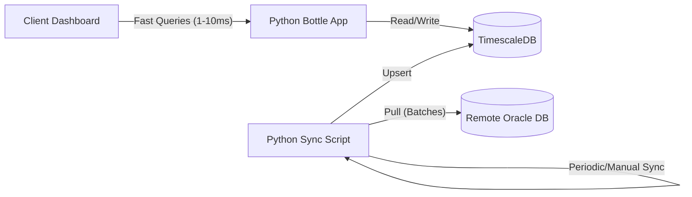

# Oracle REST to TimescaleDB Synchronization Analysis

This document provides a technical analysis and proposal for implementing a synchronization process between the remote Oracle REST Data Services (ORDS) endpoints and the local TimescaleDB instance. The local database will act as a high-performance caching layer to ensure sub-millisecond query responses for the frontend, bypassing the slow response times of the remote Oracle service.

---

## 1. Validation of Remote Oracle Endpoints

Through live metadata catalog discovery on `https://analisi.intexsrl.com/ords/intex2/open-api-catalog/`, we validated the active endpoints on the remote server. The actual configuration differs from the original project documentation in several key ways:

### 1.1. Active Endpoints List
The following remote views are confirmed available for querying:

| Entity | Remote View Endpoint | AutoREST / Namespace | Description |
| :--- | :--- | :--- | :--- |
| **Clienti** | `R07_R0236_C012456789_001W` | AutoREST | Customer master records. |
| **DDT (Bolle) Header** | `D02_DDT_TESTATA_001W` | AutoREST | Delivery note headers. |
| **DDT (Bolle) Lines** | `D03_DDT_RIGHE_001W` & `D03_DDT_RIGHE_002W` | AutoREST | Delivery note detail lines. `_002W` exposes ISO date fields. |
| **Fatture** | `F07_003W` | AutoREST | Invoice line details (Disposition groups). |
| **Offerte / Ordini** | `F03_001W` | AutoREST | Sales quotes / commercial offers. |
| **Codici IVA** | `C01_CODICI_IVA_001W` | AutoREST | VAT codes lookup. |
| **Agenti** | `C07_R02_C023_001W` | AutoREST | Agent lookup. |
| **Articoli** | `CW1_ARTICOLI_FISCALI_001W` | AutoREST | Article master records. |
| **Composizioni** | `CW4_COMPOSIZIONI_001W` | AutoREST | Material composition records. |
| **Linee Tintoria** | `CW0_001W` | AutoREST | Dyeing line lookup. |

### 1.2. Dropped or Missing Endpoints
- **`Z11_STAGIONI` (Seasons)**: The dedicated seasons view listed in old documentation is **completely missing (404)**. It was dropped by the administrator during a cleanup phase.
- **Old `/v1/` routes**: Most older endpoints (e.g. `v1/R07_R0236_C012456789_001W`) were dropped to consolidate views under the AutoREST root namespace `/ords/intex2/`.
- **Workaround for Seasons**: The seasons list must be dynamically extracted via the invoice line records (`F07_003W`) by compiling unique values from the `ew2_cd_stagione` column, which contains codes like `AI 12`, `PE 12`, `PE 13`.

---

## 2. Caching Architecture

Executing live, real-time requests from the user's dashboard directly to the remote Oracle REST server will result in a degraded user experience. During testing, simple queries (such as listing a single row) encountered read timeouts of **5+ seconds**.

### Caching Layout


- **All Reads go to TimescaleDB**: The Bottle API queried by the React dashboard reads exclusively from local TimescaleDB tables, guaranteeing response times in milliseconds.
- **Unidirectional Write**: Synchronization runs in the background. Data flows strictly one-way: Oracle REST -> TimescaleDB cache.

---

## 3. Synchronization Strategies: Full Reload vs. Incremental

To populate the local cache, the sync process can be run **manually** (via CLI command or admin button) or scheduled (cron). There are two primary approaches for updating the cache tables:

### 3.2. Comparison Analysis

| Feature | Full Reload (Truncate & Insert) | Incremental Sync (Upsert) |
| :--- | :--- | :--- |
| **Complexity** | Extremely low. | High (requires tracking state & dates). |
| **Data Safety** | High. Guarantees 100% exact copy of the source. | Medium. Risk of missing records if modification dates are absent. |
| **Database Load** | Very high. Rewrites entire tables. | Very low. Only writes new/modified records. |
| **Network Traffic**| High. Downloads all historical records. | Low. Only downloads recent changes. |
| **Handling Deleted Records** | Perfect. Deleted remote records are naturally removed. | Hard. If a remote document is deleted, the cache won't know. |

### 3.2. Recommended Strategy: Hybrid Model
To maximize performance while ensuring data integrity:
1. **Regular Sync (Incremental)**: Run hourly or daily. Query only records created or modified in the current season/month.
2. **Weekly Sync (Full Reload)**: Run during low-activity windows (e.g. Sunday night) to refresh the entire database, clean up any deleted records, and rebuild indexes.

---

## 4. Timeout Prevention, Safety, and Pagination

Oracle ORDS endpoints can experience performance exhaustion or trigger API gateway safety shields if too much data is requested at once. To prevent connection timeouts and avoid overloading the remote database:

### 4.1. Pagination Policy
Oracle ORDS supports pagination using `limit` and `offset` query parameters.
- **Never fetch without `limit`**: A request returning tens of thousands of rows will crash the remote gateway or trigger timeouts.
- **Chunk Size**: Use a strict batch size (e.g., `limit=100` or `limit=200` rows).
- **Iteration Loop**: Continue requesting with increasing offsets (`offset=0`, `offset=200`, `offset=400`) until the `items` array in the response is empty.

### 4.2. Sample Python Pagination Loop
```python
def fetch_paginated_view(connector, path, filters=None):
    all_items = []
    limit = 100
    offset = 0
    
    while True:
        # Build query parameters
        query_params = {"limit": limit, "offset": offset}
        if filters:
            query_params["q"] = connector.build_ords_query(filters)
            
        # Execute query
        data = connector.fetch_data(path, query_params)
        items = data.get("items", [])
        
        if not items:
            break
            
        all_items.extend(items)
        
        # Check if there is more data according to ORDS metadata
        if not data.get("hasMore", False):
            break
            
        offset += limit
        
    return all_items
```

### 4.3. Incremental Upsert logic in TimescaleDB
To write the fetched records into the local database, use PostgreSQL `INSERT ... ON CONFLICT (id) DO UPDATE` queries. This prevents duplicate keys and ensures existing entries are updated to their newest remote state:

```sql
INSERT INTO ddt_testate (numero_bolla, data_bolla, codice_cliente, codice_stagione)
VALUES (%s, %s, %s, %s)
ON CONFLICT (numero_bolla) 
DO UPDATE SET 
    data_bolla = EXCLUDED.data_bolla,
    codice_cliente = EXCLUDED.codice_cliente,
    codice_stagione = EXCLUDED.codice_stagione;
```

---

## 5. Security & Safety Guidelines
- **Authentication**: Store API credentials securely inside backend `.env` variables (`INTEX_ENDPOINT_USER`/`INTEX_ENDPOINT_PASSWORD`).
- **Throttling**: Put a short sleep timer (e.g., `time.sleep(0.5)`) between pagination pages to avoid hitting server rate limits (HTTP 429 Too Many Requests).
- **Concurrency**: Only allow one sync process to run at a time (using a simple file lock or database lock flag) to prevent duplicate overlapping updates.
